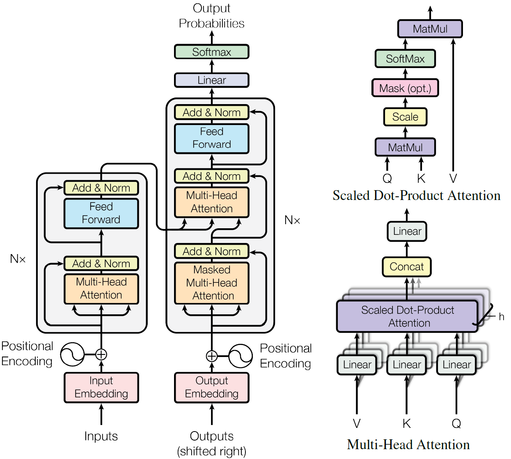
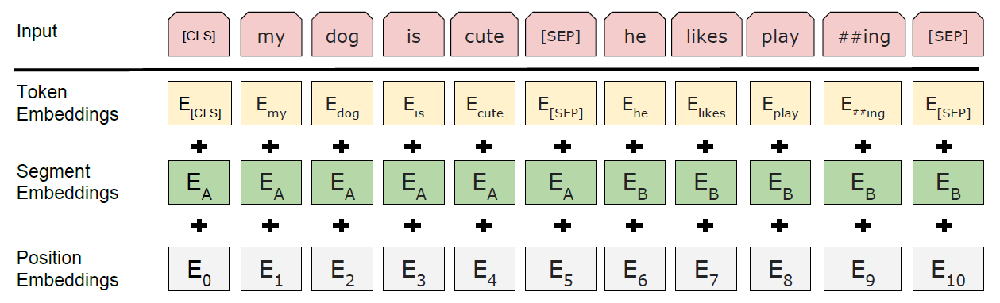
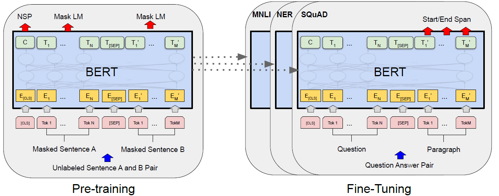

# Transformer

> Vaswani, Ashish, et al. "Attention is all you need." *Advances in neural information processing systems* 30 (2017).




## Attention

- 注意力函数是将一个query和一个(key, value)对集合映射到一个输出的函数，其中query, keys, values都是向量
- 输出是value的加权和，对于每个value的权重是value对应的key和query的相似度计算得到的

### Scaled Dot-Product Attention

$$
\mathrm{Attention}(Q, K, V) = \mathrm{Softmax}(\frac{QK^T}{\sqrt{d_k}})V
$$

- $Q^{n\times d_k}$：Query Matrix.  $n$是查询数，$d_k$是key vector的维度
- $K^{m\times d_k}$：Key Matrix.  $m$是键值对数
- $V^{m\times d_v}$：Value Matrix. $d_v$是value vector的维度
- Scaling factor $\sqrt{d_k}$：如果$d_k$太大，内积的差距可能很大，Softmax之后过大的会接近1，接近greedy，所以要scaled


### Mask

Decoder的第一个self-attention中，由于是AR模型，在 $t$ 时刻的预测中仅允许看到 $t$ 时刻以前的信息

即 $q_t$ 只与$[k_1, \dots, k_{t-1}]$计算相关性，而需要遮盖住$[k_t, \cdots, k_n]$这些信息

方法：对于$[k_t, \cdots, k_n]$这些值，替换成一个非常大的负数，Softmax之后权重会变成0，使attention的输出不包含对应的value


### Multi-Head Attention

多模式：将Q, K, V投影到 $h$ 个相互独立的低维空间，做 $h$ 次的Attention，再Concat所有函数的输出，再投影作为最终的输出。
$$
\mathrm{MultiHead}(Q, K, V) = \mathrm{Concat}(\mathrm{head_1}, \dots, \mathrm{head_h})W^O\\
\mathrm{where}\;\;\mathrm{head_i} = \mathrm{Attention}(QW_i^Q, KW_i^K, VW_i^V)
$$
因为Attention没什么可学习参数，Multi-Head引入可学习参数增大模型表示容量。

## Encoder-Decoder架构

序列转录：

- Encoder： sequence $(x_1, \dots, x_n)\rightarrow(z_1, \dots, z_n)$  Auto-Encoder 一次可以看全所有信息
- Decoder： sequence$(z_1, \cdots, z_n)\rightarrow(y_1, \dots, y_m)$  Auto-Regressive 一次只能生成一个token

### Encoder

- muiti-head self-attention
- position-wise fully connected feed-forward network
- residual connection around each sub-layers. ==$\mathrm{LayerNorm(x+\mathrm{Sublayer(x)})}$==

### Decoder

- masked multi-head self-attention（防止模型看到之后的内容，保证训练和预测时行为一致）
- multi-head self-attention
- position-wise fully connected feed-forward network
- residual connection around each sub-layers. ==$\mathrm{LayerNorm(x+\mathrm{Sublayer(x)})}$==

## 其他组件

### Position-wise Feed-Forward Networks

$$
\mathrm{FFN}(x) = \max(0, xW_1 + b_1)W_2 + b2
$$

- $W_1$：$d_{model}\times 4d_{model}$
- $W_2$：$4d_{model}\times d_{model}$

RNN vs Transformer

- RNN和Transformer一样，用一个线性层做语义空间的转换
- 不同的是，如何传递序列信息
  - RNN：把上一个时刻的输出传入下一个时刻做输入
  - Transformer：通过一个attention层，在全局拉去整个序列相关的信息，再做语义转换


### Embedding

tokenization：tokens -> vectors of dimension $d_{model}$

将权重乘了$\sqrt{d_{model}}$：学Embedding时，会将L2 Norm归一化。维度越大的向量归一化后单个值越小。之后加Positional Encoding时，乘以 $\sqrt{d_{model}}$ 保证二者的Scale相匹配


### Positional Encoding

attention是没有时序信息的，需要将序列信息显式地表示出来。
$$
PE_{(pos, 2i)}=\sin(pos/10000^{2i/d_{model}})\\
PE_{(pos, 2i+1)}=\cos(pos/10000^{2i/d_{model}})
$$

## Pytorch实现

```python
import numpy as np
import torch
import torch.nn as nn
import torch.nn.functional as F
import math, copy, time
from torch.autograd import Variable


class EncoderDecoder(nn.Module):
    """
    A standard Encoder-Decoder architecture. Base for this and many
    other models.
    """

    def __init__(self, encoder, decoder, src_embed, tgt_embed, generator):
        super(EncoderDecoder, self).__init__()
        self.encoder = encoder
        self.decoder = decoder
        self.src_embed = src_embed  # 映射 [B,L] -> [B,L,d_model]
        self.tgt_embed = tgt_embed  # 映射 [B,L_out] -> [B,L_out,d_model_out]
        self.generator = generator

    def forward(self, src, tgt, src_mask, tgt_mask):
        """
        Take in and process masked src and target sequences.
        """
        return self.decode(self.encode(src, src_mask), src_mask, tgt, tgt_mask)

    def encode(self, src, src_mask):
        """
        调用Encoder类 其中x变化 但mask 不变
        src_embed [batch,len,d_model], src_mask [batch,1,len]->[batch,1,1,len] src中不为0地方True
        """
        return self.encoder(self.src_embed(src), src_mask)

    def decode(self, memory, src_mask, tgt, tgt_mask):
        """
        tgt_embed [batch,len-1,d_model]
        memory [batch,len,d_model]
        src_mask [batch,1,1,len]
        tgt_mask [batch,len-1,len-1] 其中[batch,len-1]是tgt去除最后一列  每个句子复制次数遍 -> [batch,1,len-1,len-1]
        掩码中右上角是False 左下角和主对角线 不为0的词为True
        """
        return self.decoder(self.tgt_embed(tgt), memory, src_mask, tgt_mask)


class Generator(nn.Module):
    """
    Define standard linear + softmax generation step.
    [B,L,d_model] -> [B,L,vocab]
    """

    def __init__(self, d_model, vocab):
        super(Generator, self).__init__()
        self.proj = nn.Linear(d_model, vocab)

    def forward(self, x):
        return F.log_softmax(self.proj(x), dim=-1)  # softmax结果取对数 映射到负数区间 防止溢出


def clones(module, N):
    """
    Produce N identical layers.
    返回列表 把输入module 复制N次
    """
    return nn.ModuleList([copy.deepcopy(module) for _ in range(N)])


class Encoder(nn.Module):
    """Core encoder is a stack of N layers"""

    def __init__(self, layer, N):
        super(Encoder, self).__init__()
        self.layers = clones(layer, N)
        self.norm = LayerNorm(layer.size)

    def forward(self, x, mask):
        """Pass the input (and mask) through each layer in turn."""
        for layer in self.layers:
            x = layer(x, mask)
        return self.norm(x)


class LayerNorm(nn.Module):
    """
    Construct a layernorm module (See citation for details).
    初始化 features 是.shape形式 需要x.shape初始化
    [B,L,d_model] -> [B,L,d_model] 按最后一个维度减均值 求方差
    """

    def __init__(self, features, eps=1e-6):
        super(LayerNorm, self).__init__()
        self.a_2 = nn.Parameter(torch.ones(features))
        self.b_2 = nn.Parameter(torch.zeros(features))
        self.eps = eps

    def forward(self, x):
        mean = x.mean(-1, keepdim=True)
        std = x.std(-1, keepdim=True)
        return self.a_2 * (x - mean) / (std + self.eps) + self.b_2


class SublayerConnection(nn.Module):
    """
    A residual connection followed by a layer norm.
    Note for code simplicity the norm is first as opposed to last.
    初始化 x.shape dropout参数
    输入 x和某层 输出 维度不变 相当于 norm sublayer dropout residual
    """

    def __init__(self, size, dropout):
        super(SublayerConnection, self).__init__()
        self.norm = LayerNorm(size)
        self.dropout = nn.Dropout(dropout)  # 一些按比例增大 一些置0

    def forward(self, x, sublayer):
        """Apply residual connection to any sublayer with the same size."""
        return x + self.dropout(sublayer(self.norm(x)))


class EncoderLayer(nn.Module):
    """
    Encoder is made up of self-attn and feed forward (defined below)
    过自我注意 再过feed_forward
    """

    def __init__(self, size, self_attn, feed_forward, dropout):
        super(EncoderLayer, self).__init__()
        self.self_attn = self_attn
        self.feed_forward = feed_forward
        self.sublayer = clones(SublayerConnection(size, dropout), 2)
        self.size = size

    def forward(self, x, mask):
        """
        Follow Figure 1 (left) for connections.
        lambda 为匿名函数
        """
        x = self.sublayer[0](x, lambda x: self.self_attn(x, x, x, mask))
        return self.sublayer[1](x, self.feed_forward)


class Decoder(nn.Module):
    """Generic N layer decoder with masking."""

    def __init__(self, layer, N):
        super(Decoder, self).__init__()
        self.layers = clones(layer, N)
        self.norm = LayerNorm(layer.size)

    def forward(self, x, memory, src_mask, tgt_mask):
        for layer in self.layers:
            x = layer(x, memory, src_mask, tgt_mask)
        return self.norm(x)


class DecoderLayer(nn.Module):
    """
    Decoder is made of self-attn, src-attn, and feed forward (defined below)
    每一个 DecoderLayer的memory都是一样的 都是多次EncoderLayer后输出的结果
    """

    def __init__(self, size, self_attn, src_attn, feed_forward, dropout):
        super(DecoderLayer, self).__init__()
        self.size = size
        self.self_attn = self_attn
        self.src_attn = src_attn
        self.feed_forward = feed_forward
        self.sublayer = clones(SublayerConnection(size, dropout), 3)

    def forward(self, x, memory, src_mask, tgt_mask):
        """Follow Figure 1 (right) for connections."""
        m = memory
        x = self.sublayer[0](x, lambda x: self.self_attn(x, x, x, tgt_mask))
        x = self.sublayer[1](x, lambda x: self.src_attn(x, m, m, src_mask))
        return self.sublayer[2](x, self.feed_forward)


def subsequent_mask(size):
    """
    Mask out subsequent positions.
    triu 返回上三角矩阵
    [1,size,size] 右上角F 左下角和对角线True
    """
    attn_shape = (1, size, size)
    subsequent_mask = np.triu(np.ones(attn_shape), k=1).astype('uint8')
    return torch.from_numpy(subsequent_mask) == 0


def attention(query, key, value, mask=None, dropout=None):
    """
    Compute 'Scaled Dot Product Attention'
    qkv[B,h,L,d_model/h] src_mask[B,1,1,L] tgt_mask[]
    score(qkT)[B,h,L,L]  src_mask[B,1,1,L] -> [B,h,L,L] B管B L只掩码所有最内层
    score(qkT)[B,h,L-1,L-1] tgt_mask[B,1,L-1,L-1]
    [[q1k1,q1k2,q1k3]
     [q2k1,q2k2,q2k3]
     [q3k1,q3k2,q3k3]] tgt右上角三个元素置0 src不去注意0 q不注意0处的k

     互注意 q[B,h,L-1,d_model/h] kv[B,h,L,d_model/h]

     [[q1k1 q1k2->0 q1k3->0]
      [q2k1 q2k2    q2k3->0]]
    """
    d_k = query.size(-1)
    scores = torch.matmul(query, key.transpose(-2, -1)) / math.sqrt(d_k)
    # score [B,L,L] mask [B,L,L]或[L,L]广播 mask中为0的地方 score中相应地方被填充为无穷小
    if mask is not None:
        scores = scores.masked_fill(mask == 0, -1e9)
    p_attn = F.softmax(scores, dim=-1)
    if dropout is not None:
        p_attn = dropout(p_attn)
    return torch.matmul(p_attn, value), p_attn


class MultiHeadedAttention(nn.Module):
    def __init__(self, h, d_model, dropout=0.1):
        """
        Take in model size and number of heads.
        [B,L,d_model] -> [B,L,d_model]
        """
        super(MultiHeadedAttention, self).__init__()
        assert d_model % h == 0  # 不为0抛出异常
        # We assume d_v always equals d_k
        self.d_k = d_model // h
        self.h = h
        self.linears = clones(nn.Linear(d_model, d_model), 4)
        self.attn = None
        self.dropout = nn.Dropout(p=dropout)

    def forward(self, query, key, value, mask=None):
        """Implements Figure 2"""
        if mask is not None:
            # Same mask applied to all h heads.
            mask = mask.unsqueeze(1)  # mask[B,1,1,L]
        nbatches = query.size(0)
        # 1) Do all the linear projections in batch from d_model => h x d_k
        # [B,L,d_model]线性化[B,L,d_model]->[B,L,h,d_model/h]->[B,h,L,d_model/h]
        query, key, value = [l(x).view(nbatches, -1, self.h, self.d_k).transpose(1, 2)
                             for l, x in zip(self.linears, (query, key, value))]
        # 2) Apply attention on all the projected vectors in batch.
        x, self.attn = attention(query, key, value, mask=mask, dropout=self.dropout)
        # x [B,h,L,d_model/h]   self.attn [B,h,L,L]
        # 3) "Concat" using a view and apply a final linear.
        x = x.transpose(1, 2).contiguous().view(nbatches, -1, self.h * self.d_k)
        # x [B,h,L,d_model/h] -> [B,L,h,d_model/h] -> [B,L,d_model]
        return self.linears[-1](x)


class PositionwiseFeedForward(nn.Module):
    """
    Implements FFN equation.
    两个MLP [B,L,d_model]->[B,L,d_model]
    """

    def __init__(self, d_model, d_ff, dropout=0.1):
        super(PositionwiseFeedForward, self).__init__()
        self.w_1 = nn.Linear(d_model, d_ff)
        self.w_2 = nn.Linear(d_ff, d_model)
        self.dropout = nn.Dropout(dropout)

    def forward(self, x):
        return self.w_2(self.dropout(F.relu(self.w_1(x))))


class Embeddings(nn.Module):
    """
    [B,L] -> [B,L,d_model]
    [B,L]中元素都为自然数 vocab至少比最大的自然数大1
    d_model 想嵌入的维度 vocab大于等于最大索引词索引数+1
    """

    def __init__(self, d_model, vocab):
        super(Embeddings, self).__init__()
        self.lut = nn.Embedding(vocab, d_model)
        self.d_model = d_model

    def forward(self, x):
        return self.lut(x) * math.sqrt(self.d_model)


class PositionalEncoding(nn.Module):
    """
    Implement the PE function.加入句子位置编码
    [B,L,d_model]->[B,L,d_model]
    """

    def __init__(self, d_model, dropout, max_len=5000):
        super(PositionalEncoding, self).__init__()
        self.dropout = nn.Dropout(p=dropout)
        # Compute the positional encodings once in log space.
        pe = torch.zeros(max_len, d_model)
        position = torch.arange(0, max_len).unsqueeze(1)  # [max_len,1] [[0],[1],...,[max_len-1]]
        div_term = torch.exp(torch.arange(0, d_model, 2) * (-(math.log(10000.0) / d_model)))  # [0,2,4,...,不包括d_model]
        pe[:, 0::2] = torch.sin(position * div_term)
        pe[:, 1::2] = torch.cos(position * div_term)
        pe = pe.unsqueeze(0)
        self.register_buffer('pe', pe)  # 网络更新时它不更新

    def forward(self, x):
        # shape [1,x.size(1),d_model] 广播机制 所有的batch即每个句子 都加上了同样的编码矩阵
        x = x + Variable(self.pe[:, :x.size(1)], requires_grad=False)
        return self.dropout(x)


def make_model(src_vocab, tgt_vocab, N=6, d_model=512, d_ff=2048, h=8, dropout=0.1):
    """Helper: Construct a model from hyperparameters."""
    c = copy.deepcopy
    attn = MultiHeadedAttention(h, d_model)
    ff = PositionwiseFeedForward(d_model, d_ff, dropout)
    position = PositionalEncoding(d_model, dropout)
    model = EncoderDecoder(
        Encoder(EncoderLayer(d_model, c(attn), c(ff), dropout), N),  # 两个编码层串联
        Decoder(DecoderLayer(d_model, c(attn), c(attn), c(ff), dropout), N),  # 两个解码层串联 两个空闲memory不接
        nn.Sequential(Embeddings(d_model, src_vocab), c(position)),  # 依次传参容器 src_vocab 输入的词有几种
        nn.Sequential(Embeddings(d_model, tgt_vocab), c(position)),  # 依次传参容器 tgt_vocab 输出的词有几种
        Generator(d_model, tgt_vocab))  # 一个MLP
    # This was important from their code.
    # Initialize parameters with Glorot / fan_avg. 初始化参数
    for p in model.parameters():
        if p.dim() > 1:
            nn.init.xavier_uniform_(p)
    return model


class Batch:
    """Object for holding a batch of data with mask during training."""

    def __init__(self, src, trg=None, pad=0):
        self.src = src
        self.src_mask = (src != pad).unsqueeze(-2)  # 加一个维度 src[batch,len] src_mask[batch,1,len] src中不为0地方True
        if trg is not None:
            self.trg = trg[:, :-1]  # trg除去最后一列 [batch,len-1]
            self.trg_y = trg[:, 1:]  # trg除去第一列  [batch,len-1]
            self.trg_mask = self.make_std_mask(self.trg, pad)
            self.ntokens = (self.trg_y != pad).data.sum()  # 返回trg除去首列 非0元素数目

    # 静态方法 不实例化类也可以通过类直接调用方法
    @staticmethod
    def make_std_mask(tgt, pad):
        """Create a mask to hide padding and future words."""
        tgt_mask = (tgt != pad).unsqueeze(-2)  # [batch,1,len-1] trg除去最后一列 不为0True
        tgt_mask = tgt_mask & Variable(
            subsequent_mask(tgt.size(-1)).type_as(tgt_mask.data))  # [1,len-1,len-1]右上角F 左下角和对角线True
        # [batch,len-1,len-1]
        # 先把句子广播[batch,len-1]->[batch,len-1,len-1]每一个句子原来用一个向量表示 现在把向量再重复
        # [B,i,:] 看B个句子 第i表示看前i个单词
        return tgt_mask


def run_epoch(data_iter, model, loss_compute):
    """Standard Training and Logging Function"""
    start = time.time()
    total_tokens = 0
    total_loss = 0
    tokens = 0
    for i, batch in enumerate(data_iter):
        out = model.forward(batch.src, batch.trg, batch.src_mask, batch.trg_mask)
        # batch.src         [batch,len]
        # batch.trg         [batch,len]
        # batch.src_mask    [batch,1,len] src中不为0地方True
        # batch.trg_mask    [batch,len-1,len-1] trg除去最后一列 重复len-1次 不为0True 再和右上F相交
        # batch.trg_y       [batch,len-1] trg除去第一列
        # batch.ntokens     返回trg除去首列 非0元素数目
        # out               [batch,len-1,d_model]->[batch,len-1,vocab]
        loss = loss_compute(out, batch.trg_y, batch.ntokens)
        total_loss += loss
        total_tokens += batch.ntokens
        tokens += batch.ntokens
        if i % 50 == 1:
            elapsed = time.time() - start
            print("Epoch Step: %d Loss: %f Tokens per Sec: %f" % (i, loss / batch.ntokens, tokens / elapsed))
            start = time.time()
            tokens = 0
    return total_loss / total_tokens


global max_src_in_batch, max_tgt_in_batch


def batch_size_fn(new, count, sofar):
    """Keep augmenting batch and calculate total number of tokens + padding."""
    global max_src_in_batch, max_tgt_in_batch
    if count == 1:
        max_src_in_batch = 0
        max_tgt_in_batch = 0
    max_src_in_batch = max(max_src_in_batch, len(new.src))
    max_tgt_in_batch = max(max_tgt_in_batch, len(new.trg) + 2)
    src_elements = count * max_src_in_batch
    tgt_elements = count * max_tgt_in_batch
    return max(src_elements, tgt_elements)


class NoamOpt:
    """Optim wrapper that implements rate."""

    def __init__(self, model_size, factor, warmup, optimizer):
        self.optimizer = optimizer
        self._step = 0
        self.warmup = warmup
        self.factor = factor
        self.model_size = model_size
        self._rate = 0

    def step(self):
        """Update parameters and rate"""
        self._step += 1
        rate = self.rate()
        for p in self.optimizer.param_groups:
            p['lr'] = rate
        self._rate = rate
        self.optimizer.step()

    def rate(self, step=None):
        """Implement `lrate` above"""
        if step is None:
            step = self._step
        return self.factor * (self.model_size ** (-0.5) * min(step ** (-0.5), step * self.warmup ** (-1.5)))


def get_std_opt(model):
    return NoamOpt(model.src_embed[0].d_model, 2, 4000,
                   torch.optim.Adam(model.parameters(), lr=0, betas=(0.9, 0.98), eps=1e-9))


class LabelSmoothing(nn.Module):
    """Implement label smoothing."""

    def __init__(self, size, padding_idx, smoothing=0.0):
        super(LabelSmoothing, self).__init__()
        self.criterion = nn.KLDivLoss(reduction='sum')
        self.padding_idx = padding_idx
        self.confidence = 1.0 - smoothing
        self.smoothing = smoothing
        self.size = size
        self.true_dist = None

    def forward(self, x, target):
        # x [B(l-1),V] target [B(l-1)]
        assert x.size(1) == self.size
        true_dist = x.data.clone()  # 复制一个x到true_dist
        true_dist.fill_(self.smoothing / (self.size - 2))  # true_dist内所有数字都换成超参数
        # target.data.unsqueeze(1) [B(l-1),1]
        print(true_dist.shape)
        print(target.data.unsqueeze(1).shape)
        true_dist.scatter_(1, target.data.unsqueeze(1), self.confidence)  # 填充或修改元素
        # 把true_dist中一些元素替换为self.confidence 每一行的target索引元素
        true_dist[:, self.padding_idx] = 0  # 所有行0列为0
        print(target.data.shape)
        print(target.data)
        mask = torch.nonzero(target.data == self.padding_idx)  # 记录下其中k个为0(self.padding_idx)元素位置(后式成立)
        print(mask)
        print(mask.dim())
        # mask.dim()=2 [[1],[4],[7]]
        if mask.dim() > 0:
            true_dist.index_fill_(0, mask.squeeze(), 0.0)  # padding位置 行所有元素需要被置0 只要是源被pad地方 相应的映射向量置0
        self.true_dist = true_dist
        print(x.shape)
        print(true_dist.shape)
        return self.criterion(x, Variable(true_dist, requires_grad=False))


def data_gen(V, batch, nbatches):
    """Generate random data for a src-tgt copy task."""
    for i in range(nbatches):
        data = torch.from_numpy(np.random.randint(1, V, size=(batch, 10)))
        data[:, 0] = 1
        src = Variable(data, requires_grad=False)  # [batch, len]
        tgt = Variable(data, requires_grad=False)  # [batch, len]
        yield Batch(src, tgt, 0)


class SimpleLossCompute:
    """A simple loss compute and train function."""

    def __init__(self, generator, criterion, opt=None):
        self.generator = generator
        self.criterion = criterion
        self.opt = opt

    def __call__(self, x, y, norm):
        x = self.generator(x)
        # y 一维 x 二维 .contiguous() 常与.view()连用 表示开辟新内存
        # x [B,len-1,V] -> [B(len-1),V] V指映射到多少词
        # y [B,len-1]   -> [B(len-1)]
        loss = self.criterion(x.contiguous().view(-1, x.size(-1)),
                              y.contiguous().view(-1)) / norm
        loss.backward()
        if self.opt is not None:
            self.opt.step()
            self.opt.optimizer.zero_grad()
        return loss.item() * norm


# # Train the simple copy task.
# V = 11  # 一共输入输出都有11种词
# criterion = LabelSmoothing(size=V, padding_idx=0, smoothing=0.0)
# model = make_model(V, V, N=2)
# model_opt = NoamOpt(model.src_embed[0].d_model, 1, 400, torch.optim.Adam(model.parameters(), lr=0, betas=(0.9, 0.98), eps=1e-9))
#
# for epoch in range(10):
#     model.train()
#     run_epoch(data_gen(V, 30, 20), model, SimpleLossCompute(model.generator, criterion, model_opt))
#     model.eval()
#     print(run_epoch(data_gen(V, 30, 5), model, SimpleLossCompute(model.generator, criterion, None)))
# # for i, batch in enumerate(data_gen(11, 30, 20)):
# #     print(i)
# #     print(batch)

my_batch = 3
my_len_src = 5
my_len_tgt = 7
my_src_vocab = 15
my_tgt_vocab = 20
my_src = torch.tensor([[2, 3, 7, 4, 0], [12, 5, 7, 0, 0], [13, 4, 2, 8, 5]])
my_tgt = torch.tensor([[1, 15, 2, 3, 4, 0, 0], [1, 18, 3, 1, 0, 0, 0], [4, 17, 5, 2, 0, 0, 0]])
my_src_mask = torch.ones([my_batch, 1, my_len_src])
my_tgt_mask = torch.ones([my_batch, my_len_tgt, my_len_tgt])
my_model = make_model(my_src_vocab, my_tgt_vocab)
print(my_model(my_src, my_tgt, my_src_mask, my_tgt_mask).shape)
```

# BERT

> Devlin, Jacob, et al. "Bert: Pre-training of deep bidirectional transformers for language understanding." *arXiv preprint arXiv:1810.04805* (2018).

相关工作：

- ELMo：*feature-based*  双向LSTM，对每个下游任务构造相关的神经网络，预训练一个好的表示。这个表示作为额外的特征，和输入一起进模型
- GPT：*fine-tuning*  Transformer-based AR模型，只能看到单向信息，预训练模型在下游的数据上进行微调。

> Peters, Matthew E., et al. “Deep contextualized word representations.” *arXiv preprint arXiv:1802.05365* (2018).
>
> Radford, Alec, et al. "Improving language understanding by generative pre-training." (2018).

## Model

Multi-layer bidirectional Transformer Encoder

## Input/Output Representations



- Token Embedding：每个token对应的embedding vector
- Segment Embedding：标志该token位于第一句话还是第二句话
- Position Embedding：标志该token的序列位置信息
- [CLS]：序列开始标志符
- [SEP]：序列分割标志符

## Training Procedure



### 预训练 pre-train

在没有标号的数据上训练。

#### task1. Cloze

对一个输入的token sequence，对每个token，有15%的概率会随机替换为一个[MASK]（不替换[CLS]和[SEP]）。

由于微调时没有[MASK]，两阶段看到的输入不一致。所以对即将被[MASK]的token：

- 80%概率替换为[MASK]：my dog is hairy -> my dog is [MASK]
- 10%概率替换为一个随机的token：my dog is hairy -> my dog is apple
- 10%维持原来的token不替换：my dog is hairy -> my dog is hairy

#### task2. Next Sentence Prediction

输入序列由两个句子A, B构成

- 50% [A, B]在原文中紧挨着：[CLS] the man went to [MASK] store [SEP] he bought a gallon [MASK] milk [SEP] -> IsNext
- 50% A, B随机抽取：[CLS] the man [MASK] to the store [SEP] penguin [MASK] are flight ##less birds [SEP] -> NotNext

### 微调 fine-tuning

用预训练结束的BERT权重+下游模型，所有的权重在下游任务微调时都参与训练。

# Vision Transformer

> Dosovitskiy, Alexey, et al. "An image is worth 16x16 words: Transformers for image recognition at scale." *arXiv preprint arXiv:2010.11929* (2020).
