# 推荐系统基础

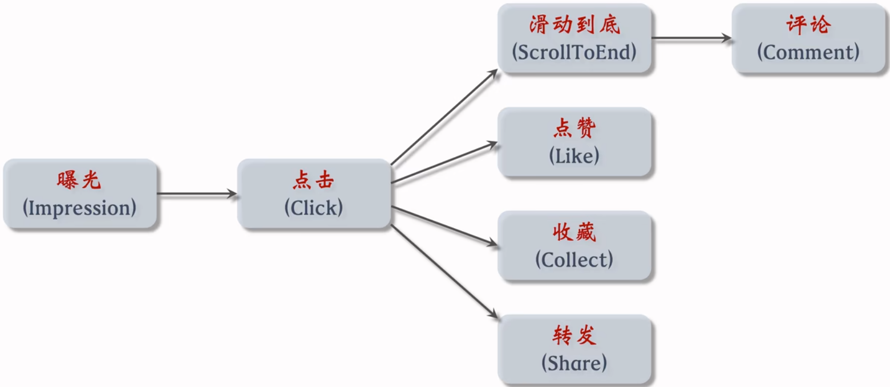

## 指标

### 理论指标

- 准确性
  - 评分预测：RMSE、MAE
  - topN推荐：召回率、精准率
- 覆盖度
  - 信息熵，对推荐越大越好（长尾效应）
  - 覆盖率

### 短期消费指标

- 点击通过率(Click-Through-Rate, CTR)$\quad\mathrm{CTR}=\frac{\mathrm{Click}}{\mathrm{Show Content}}\times100\%$
- 转化率(Conversion Rate, CVR)$\quad\mathrm{CVR}=\frac{转化量}{点击量}\times100\%$

### 北极星指标（唯一关键指标 One Metric that matters, OMTM）

- 日活用户数（DAU）、月活用户数（MAU）
- 人均使用推荐的时长
- 发布渗透率、人均发布量

### Exploitation & Exploration 探索与利用问题

- Exploitation：选择现在可能最佳的方案
-  Exploration：选择现在不确定，但未来可能有高收益的方案
- 实践
  - 兴趣扩展：相似话题、搭配推荐
  - 人群算法：userCF、用户聚类
  - 平衡个性化推荐和热门推荐比例
  - 随机丢弃用户行为历史
  - 随机扰动模型参数
- 问题
  - 伤害用户体验，导致用户流失
  - 长期收益（留存率）评估周期长，KPI压力大
  - 平衡实时兴趣和长期兴趣

## 实验流程

- 离线实验：在历史数据上做训练、测试，与用户无交互
- 小流量AB测试：把算法部署到产品中，与用户做交互（验证效果、调整超参）
- 全流量上线

分层实验：

> Tang, Diane, et al. "Overlapping experiment infrastructure: More, better, faster experimentation." *Proceedings of the 16th ACM SIGKDD international conference on Knowledge discovery and data mining*. 2010.

- 将用户按哈希分桶
- 将推荐链路分为召回、粗排、精排、重排、用户界面、广告等层
- 同层互斥：同一层的实验必须占据不同的桶，避免一个用户在同层被两个实验影响
- 不同层正交：每层独立随机对用户分桶，可以独立用100%用户做实验

其他：

- Holdout：保留10%用户，完全不受实验影响，考察整个部门对业务指标的贡献
- 实验推全：新建一个推全层，与其它层正交
- 反转实验：在新的推全层上，保留一个小的反转桶，使用旧策略。长期观察新旧策略的diff

## 链路

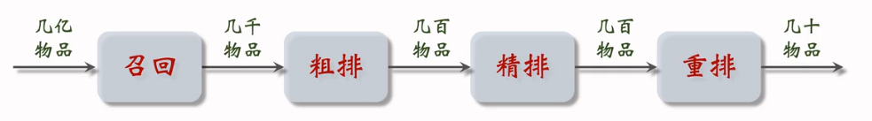

- 召回通道：协同过滤、双塔模型、关注的作者。每个通道取一定数量物品，在去重和过滤后进入下一阶段。（决定推荐结果的天花板）

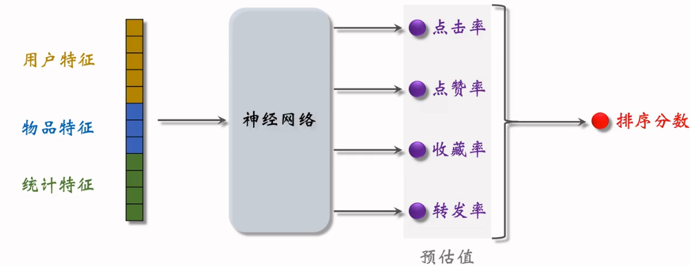

- 粗排：用简单的模型快速打分，保留分数最大的物品
- 精排：用较大的神经网络和更多的特征打分，打分更可靠，计算量更大（逼近召回的天花板，决定推荐效果）
- 重排：根据多样性做随机抽样(MMR、DPP)，并把相似的物品打散，插入广告等

## 技术架构

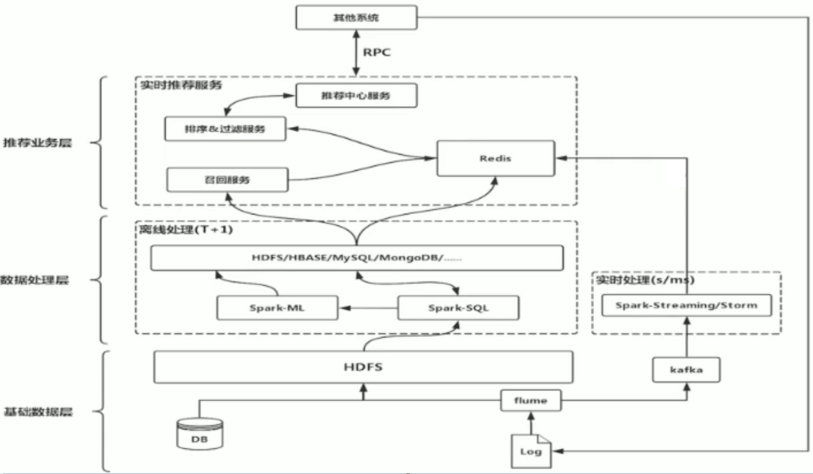

# 召回

## 协同过滤 Collaborative Filtering

思想：物以类聚，人以群分

算法：

- 矩阵分解，构建user-item矩阵
- 找出top-N相似的user / item
- 根据相似的user / item生成召回结果

### 计算相关性

- 余弦相似度 Cosine Similarity ==实数距离==

  - $$
    sim(u, v) = \frac{\sum_{i=1}^Nu_iv_i}{\sqrt{\sum_{i=1}^Nu_i^2}\sqrt{\sum_{i=1}^Nv_i^2}}
    $$

  - 用夹角的余弦值度量相似的情况

  - 相似度与向量长度无关，只要方向一致都被视为相似

- 皮尔逊相关系数Pearson Similarity Coefficient ==实数距离==

  - $$
    sim(u, v) = \frac{\sum_{i=1}^N(u_i-\bar{u})(v_i-\bar{v})}{\sqrt{\sum_{i=1}^N(u_i-\bar{u}^2)}\sqrt{\sum_{i=1}^N(v_i-\bar{v}^2)}}
    $$

  - 均值为0的余弦相似度

- 杰卡德相关系数Jaccard Similarity Coefficient ==布尔距离==

  - 两个集合的交集元素个数在并集中所占的比例
  - 分子：两个布尔向量做点积运算（交集元素个数）
  - 分母：两个布尔向量做或运算，再求元素和（并集元素个数）

在计算时可以考虑降低热门物品的权重

实现：

```python
import pandas as pd
from sklearn.metrics import jaccard_similarity_score
from sklearn.metrics.pairwise import pairwise_distances

users = ["User 1", "User 2", "User 3", "User 4", "User 5"]
items = ["Item A", "Item B", "Item C", "Item D", "Item E"]

datasets = [
    [1, 0, 1, 1, 0],
    [1, 0, 0, 1, 1],
    [1, 0, 1, 0, 0],
    [0, 1, 0, 1, 1],
    [1, 1, 1, 0, 1]
]

df = pd.DataFrame(datasets, columns=items, index=users)

# Item A和Item B的杰卡德相关系数
print(jaccard_similarity_score(df["Item A"], df["Item B"]))

# 用户相似度
user_similarity = 1 - pairwise_distances(df, metric='jaccard')
user_similarity = pd.DataFrame(user_similarity, columns=users, index=users)

print(user_similarity)

# 物品相似度
item_similarity = 1 - pairwise_distances(df.T, metric='jaccard')
item_similarity = pd.DataFrame(item_similarity, columns=items, index=items)

print(item_similarity)
```

### 构建user-item矩阵

- 稠密矩阵：预测缺失值

  - user-based预测（邻近用户加权评分）
    $$
    pred(u, i) = \hat r_{ui} = \frac{\sum \mathrm{sim}(u, v)r_{vi}}{\sum|\mathrm{sim}(u, v)|}
    $$

    ```python
    import pandas as pd
    
    users = ["User 1", "User 2", "User 3", "User 4", "User 5"]
    items = ["Item A", "Item B", "Item C", "Item D", "Item E"]
    
    datasets = [
        [5, 3, 4, 4, None],
        [3, 1, 2, 3, 3],
        [4, 3, 4, 3, 5],
        [3, 3, 1, 5, 4],
        [1, 5, 5, 2, 1]
    ]
    
    # 用户之间相似度, 默认列计算相似度, 算行的需要转置
    user_similarity = df.T.corr()
    print(user_similarity.round(4))
    ```

  - item-based预测（相似物品加权评分）
    $$
    pred(u, i)=\hat r_{ui} = \frac{\sum\mathrm{sim}(i, j)r_{u, j}}{\sum|\mathrm{sim}(i, j)|}
    $$

    ```python
    # 物品之间相似度
    item_similar = df.corr()
    print(item_similar.round(4))
    ```

- 稀疏矩阵：矩阵分解

### 基于用户的协同过滤 User-based CF

思想：与你==喜好相似的人==喜欢的东西，你也可能喜欢

- 给用户$A$找到最相似的$N$个用户
- 这些用户消费过的物品去重 - $A$用户已经消费过的 = 推荐结果

实现：

```python
import numpy as np
from pprint import pprint

# User-based CF
topN_users = {}

for i in user_similarity.index:
    _df = user_similarity.loc[i].drop(i)
    _df_sorted = _df.sort_values(ascending=False)

    top2 = list(_df_sorted.index[:2])
    topN_users[i] = top2

pprint(topN_users)

rs_results = {}
for user, sim_users in topN_users.items():
    rs_result = set()
    for sim_user in sim_users:
        rs_result = rs_result.union(set(df.ix[sim_user].replace(0, np.nan).dropna().index))
    rs_result -= set(df.ix[user].replace(0, np.nan).dropna().index)
    rs_results[user] = rs_result

pprint(rs_results)
```

#### 部署

- 离线计算
  - 建立用户->物品索引：记录每个用户最近点击、交互过的物品ID
  - 对userCF，建立用户->用户索引：计算用户两两相似度，对每个用户，索引它最相似的$k$个物品
- 线上召回
  1. 给定用户ID，通过用户->用户索引拿到top-k相似的用户
  2. 对top-k的每个用户，通过用户->物品索引找到用户近期感兴趣的last-n列表
  3. 对于取回的相似物品($\le nk$)，用公式预估兴趣分数
  4. 按兴趣分数从高到低排序，返回前$M$个作为召回结果

### 基于物品的协同过滤 Item-based CF

思想：与你喜好的东西==相似的东西==，你也可能喜欢

算法：

- 找到$A$用户消费记录中每个物品的最相似的$N$个物品
- 相似物品去重 - $A$用户已经消费过的 = 推荐结果

```python
# Item-based CF
topN_items = {}

for i in item_similarity.index:
    _df = item_similarity.loc[i].drop(i)
    _df_sorted = _df.sort_values(ascending=False)

    top2 = list(_df_sorted.index[:2])
    topN_items[i] = top2

pprint(topN_items)

rs_results = {}
for user in df.index:
    rs_result = set()
    for item in df.ix[user].replace(0, np.nan).dropna().index:
        rs_result = rs_result.union(topN_items[item])
    rs_result -= set(df.ix[user].replace(0, np.nan).dropna().index)
    rs_results[user] = rs_result

pprint(rs_results)
```

#### 部署

- 离线计算
  - 建立用户->物品索引：记录每个用户最近点击、交互过的物品ID
  - 建立物品->物品索引：计算物品两两相似度，对每个物品，索引它最相似的$k$个物品
- 线上召回(itemCF)
  1. 给定用户ID，通过用户->物品索引拿到用户近期感兴趣的物品列表(last-n)
  2. 对last-n的每个物品，通过物品->物品索引拿到top-k相似的物品
  3. 对于取回的相似物品($\le nk$)，用公式预估兴趣分数
  4. 按兴趣分数从高到低排序，返回前$M$个作为召回结果

### 近邻模型的问题

- 物品之间存在相关性信息量不随着向量维度增加而线性增加
- 矩阵元素稀疏，计算结果不稳定,增减一个向量维度，导致近邻结果差异很大的情况存在

### 基于模型的协同过滤 Model-based CF

思想：

- 通过机器学习算法，在数据中找出模式，并将用户与物品间的互动方式模式化
- 基于模型的协同过滤方式是构建协同过滤更高级的算法

#### 基于图的模型

- 基于邻域的模型是图模型的简单形式

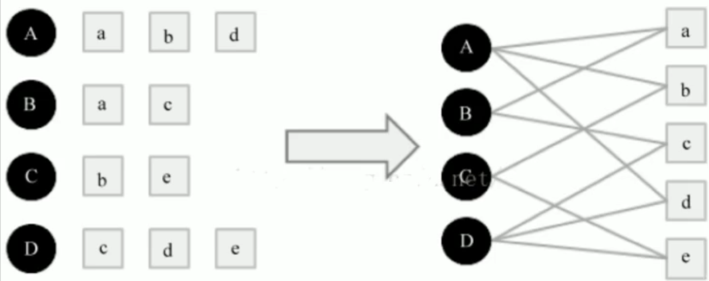

二分图 Bipartite Graph：

- 顶点集$V$可分割为两个互不相交的子集，图中每条边依附的两个顶点都分属于这两个互不相交的子集，两个子集内的顶点不相邻。
- 路径数越多，路径长度越短，路径经过的顶点数越少，相关性越大

$e.g.$ $A$与$B$的相关性：

- $A \rightarrow a \rightarrow B$
- $A \rightarrow d \rightarrow D \rightarrow c \rightarrow B$
- $A \rightarrow b \rightarrow C \rightarrow e \rightarrow D \rightarrow c \rightarrow B$

#### 矩阵分解

思想：把user-item大矩阵近似分解成两个小矩阵的乘积

- 假设有$M$个用户，$N$个物品构成的矩阵$A_{M\times N}$，选取$k\ (k << \min(M, N))$
- 计算两个矩阵$U, V$，令$U_{M\times k}V^T{n\times k}$约等于$A_{M\times N}$

方法：

- ALS交替最小二乘

  - ALS-WR（加权正则化交替最小二乘法）Alternating-least-squares with weighted-$\lambda$-regularization
  - 将用户对商品的评分矩阵分解为两个矩阵，一个是用户对商品隐含特征的偏好矩阵，另一个是商品所包含的隐含特征的矩阵。在这个矩阵分解的过程中，评分缺失项得到了填充，也就是说可以基于这个填充的评分来给用户做商品推荐了。

  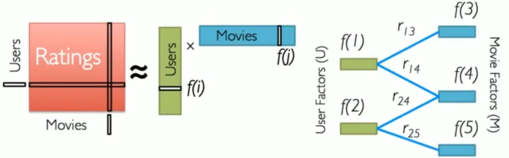

  - 算法：梯度下降迭代，优化目标：

  $$
  \min\sum_{(i, j, y)}(y_{ij}-<u_i\cdot v_j>)^2+\lambda\Vert w\Vert_2^2
  $$

  

- SVD奇异值分解矩阵

矩阵分解缺点：

- 仅用ID Embedding，没有利用物品和用户的基础属性特征
- 负样本选取方式不对（没点击看做不感兴趣）
- 训练方法不好
  - 内积不如余弦相似度
  - 平方损失（回归）不如交叉熵损失（分类）

部署：

- 模型存储：训练得到矩阵$U, V$
  - 用户矩阵：存储到key-value表，给定ID查找embedding vector
  - 物品矩阵：如构成散点图，便于最近邻查找
    - 将散点图分区，并且为每个区块选择一个代表向量
    - 计算用户embedding和所有代表向量的相似度，选择相似度最大的那个分区
    - 计算用户embedding和分区内所有物品的相似度，返回相似度最大的$M$个物品

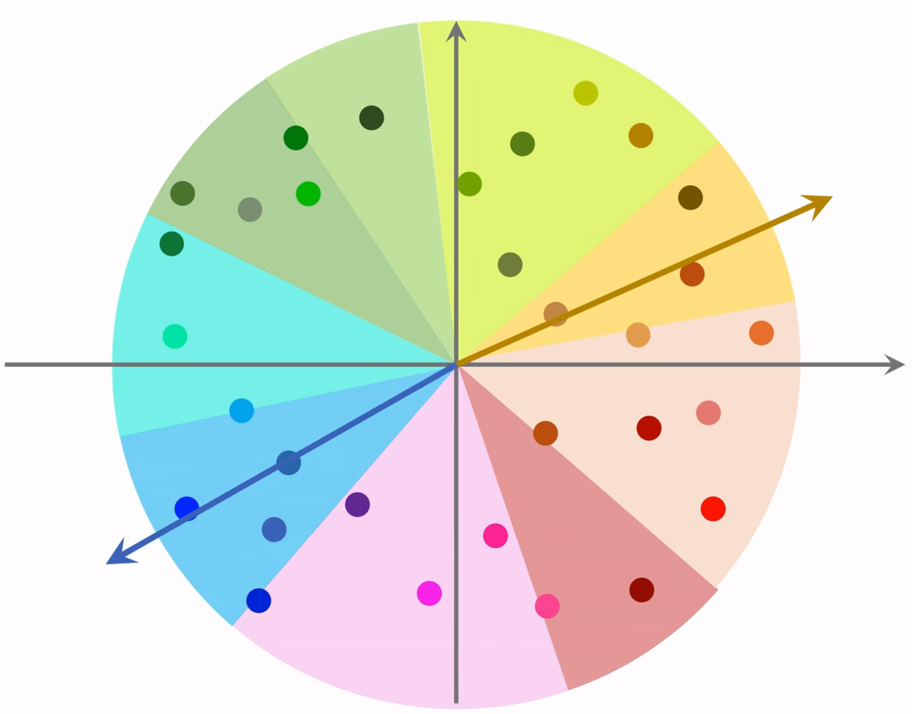

- 线上服务
  - 根据用户ID查表拿到embedding vector，记为$a$
  - 最近邻查找：查找用户最有可能感兴趣的$k$个物品

## Swing

动机：解决小圈子问题，两篇不相关的文章可能被分享到同一个群，导致点击的人群重合度高，从而被CF判定为相关进行后续推荐。

算法：

- 设$u_1, u_2$是两个用户，他们喜欢的物品集合为$\mathcal{J}_1, \mathcal{J}_2$

- 定义两个用户重合度：
  $$
  \mathrm{overlap}(u_1, u_2) = |\mathcal{J}_1 \cap \mathcal{J}_2|
  $$

- 如果$u_1, u_2$的重合度高，则可能来自一个小圈子，要降低他们的权重：

  - 设$i_1, i_2$是两个物品，喜欢它们的用户集合记作$\mathcal{W}_1, \mathcal{W}_2$
  - 定义交集$\mathcal{V} = \mathcal{W}_1 \cap \mathcal{W}_2$
  - 物品相似度计算：

  $$
  \mathrm{sim}(i_1, i_2) = \sum_{u_1\in \mathcal{V}}\sum_{u_2\in \mathcal{V}}\frac{1}{a+\mathrm{overlap}(u_1, u_2)}
  $$

  其中 $a$ 是一个超参数

## 双塔模型

### 思想

- 用户塔、物品塔各输出一个向量
- 两个向量的余弦相似度作为兴趣的预估值

### 算法

- 求用户、物品特征
  - 用户、物品ID：通过用户ID拿到用户画像（Embedding Layer）
  - 离散特征：将每个离散特征分别映射到向量（Embedding Layer）维度小的（如用户性别）可以直接onehot
  - 连续特征：归一化、分桶等
  - 将所有特征进行Concat，并经过一个投影得到特征向量
- 求用户、物品特征向量的相似度

### 训练方式

- Pointwise：独立看待每个正负样本，做简单的二分类

  - 把召回看做二元分类，对于正样本，鼓励$\cos(a, b)$接近1，对于负样本，鼓励$\cos(a, b)$接近-1
  - 控制正负样本数量在1:2到1:3

- Pairwise：每次取一个正样本和一个负样本  [Triplet Loss](./损失函数.md#Triplet loss)

  - 鼓励$\cos(a, b^+)$大于$\cos(a, b^-)$，且两者之差越大越好
  - Triplet hinge loss：$L(a, b^+, b^-)=\max\{0, \cos(a, b^-)+\alpha-cos(a, b^+)\}$
  - Triplet logistic loss$L(a, b^+, b^-)=\log(1+\exp[\sigma\cdot(\cos(a, b^-)-\cos(a, b^+))])$     $\sigma$为超参数

  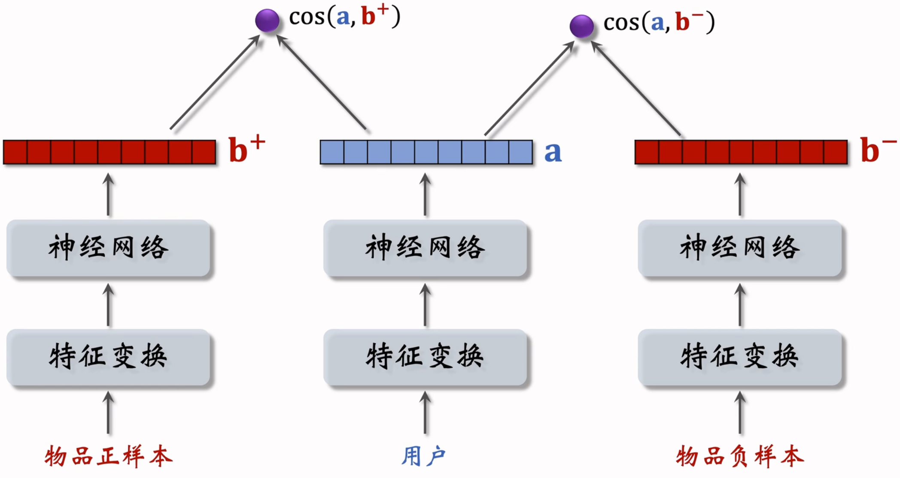

> Huang, Jui-Ting, et al. "Embedding-based retrieval in facebook search." *Proceedings of the 26th ACM SIGKDD International Conference on Knowledge Discovery & Data Mining*. 2020.

- Listwise：每次取一个正样本，多个负样本，训练方式类似多元分类

  - 分别计算$\cos(a, b^+), \cos(a, b_1^-), \cdots, \cos(a, b_n^-)$
  - 鼓励$\cos(a, b^+)$尽量大，$\cos(a, b_1^-), \cdots, \cos(a, b_n^-)$尽量小

  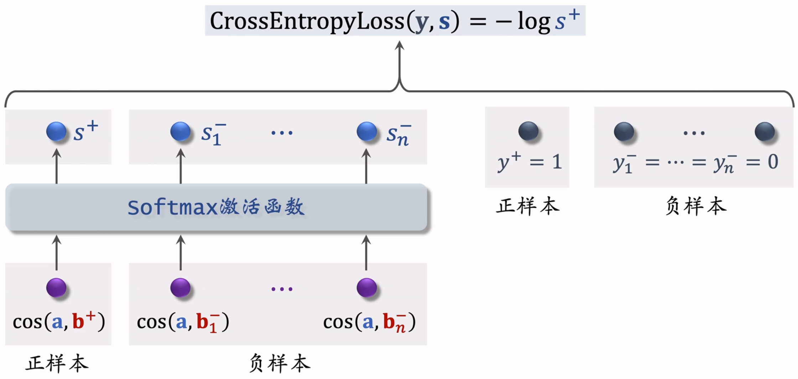

> Yi, Xinyang, et al. "Sampling-bias-corrected neural modeling for large corpus item recommendations." *Proceedings of the 13th ACM Conference on Recommender Systems*. 2019.

### 正负样本选择

正样本：用户点击的物品，存在马太效应（少部分物品占大部分点击）

- 过采样冷门物品（让一个样本出现多次），或降采样热门物品（抛弃一些样本）

负样本：

- 简单负样本：

  - 没有被召回的（约等于全体物品）直接抽样作为负样本
    - 均匀抽样：负样本大多是冷门物品，对冷门物品不公平
    - 非均匀抽样：打压热门物品，抽样概率与热门程度（点击次数）正相关，如$抽样概率\propto点击次数^{0.75}$
  - batch内负样本
    - 一个batch如果有$n$个正样本，可以形成$n(n-1)$个负样本
    - 问题：一个物品$出现在batch内的概率\propto点击次数$，但我们期望$抽样概率\propto点击次数^{0.75}$，这里热门物品成为负样本的概率过大，打压过于严重，需要修正偏差：
      - 记物品$i$被抽样到的概率$p_i\propto点击次数$，反应物品$i$热门程度。
      - 双塔模型用余弦相似度预估用户对物品$i$的兴趣：$\cos(a, b_i)$
      - 做训练时，调整为$\cos(a, b_i)-\log p_i$
      - 召回时，仍用$\cos(a, b_i)$估计

  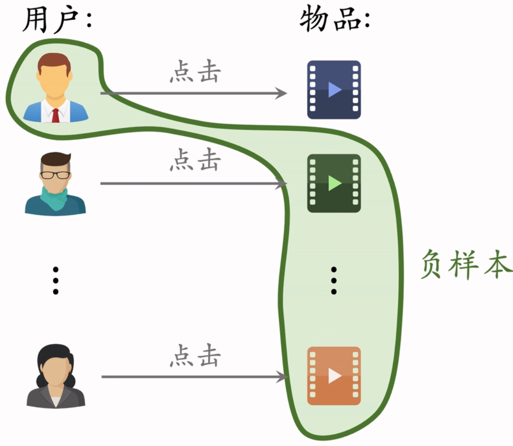

- 困难负样本

  - 被召回但被粗排淘汰（比较困难）：用户对物品有兴趣，但是不够强。容易错判
  - 精排分数靠后的物品（非常困难）：非常容易错判

- 混合简单负样本和困难负样本（各50%）

曝光但没点击的物品：这些样本应该作为训练排序模型的负样本，如果用作召回模型负样本会影响模型整体性能

### 部署

- 离线存储：将物品ID和物品特征向量$b$保存到向量数据库（如Milvus、Faiss、HnswLib）

- 线上召回

  - 给定用户ID和特征，在线上计算向量$a$（用户兴趣动态变化，且代价不大）
  - 在向量数据库中查找最近邻

- 更新

  - 全量更新：今天凌晨，用昨天全天数据训练一个epoch，发布新的用户塔和物品向量供线上召回使用
    - 对数据流、系统要求不高，没有实时性要求
  - 增量更新：online-learning更新模型参数（小时级别频繁更新）因为用户兴趣会随时发生变化
    - 实时收集线上数据，做流式处理，生成TFRecord文件
    - 对模型做online learning，增量更新ID Embedding参数，不更新其他参数 
    - 发布新的用户ID Embedding，供用户塔线上计算用户向量

  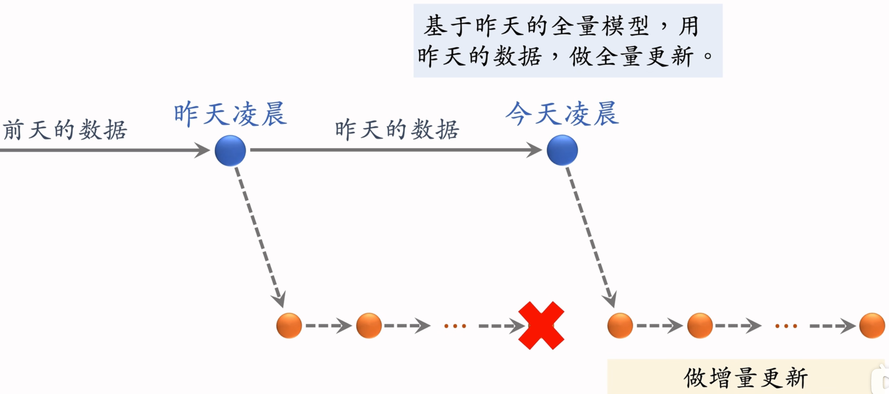

- 全量更新 vs. 增量更新
  - 小时级数据有偏，分钟级数据偏差更大
  - 全量random shuffle一天的数据，做1epoch训练
  - 增量按数据从早到晚的顺序，做1epoch训练
  - 随机打乱优于顺序排列，所以全量更新效果更好，而增量训练主要用于实时捕捉用户兴趣

### 结合自监督学习：改进物品塔

动机：缓解马太效应，让长尾物品能学到比较好的表征

方法：自监督学习，做数据增强

> Yao, Tiansheng, et al. "Self-supervised learning for large-scale item recommendations." *Proceedings of the 30th ACM International Conference on Information & Knowledge Management*. 2021.

- 物品$i$的向量表征$b_i'$和$b_i''$应有较高相似度，尽管它们来自不同的特征变换
- 物品$i$和$j$的向量表征$b_i'$和$b_j'$应具有较低相似度
- 鼓励$\cos(b_i', b_i'')$尽量大，而$\cos(b_i', b_j')$尽量小

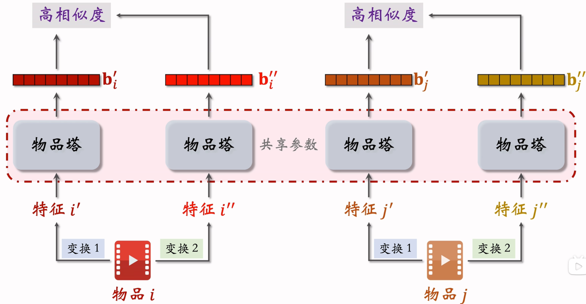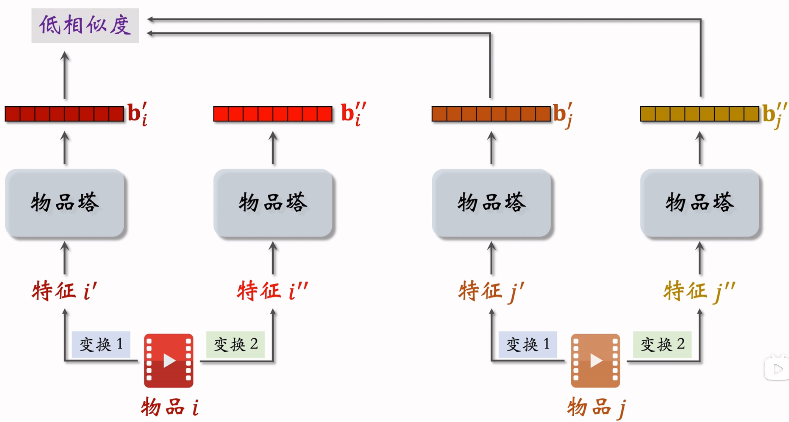

特征变换：

- Random Mask

  - 随机选择离散特征，将该特征遮住$\quad\mathcal U=\{数码, 摄影\} \rightarrow\mathcal U'=\{\mathrm{default}\}$

- Dropout（仅对多值离散特征有效）

  - 随机丢弃特征中50%的值$\quad\mathcal U=\{美妆, 摄影\} \rightarrow\mathcal U'=\{美妆\}$

- 互补特征

  - 假设物品有四个特征{ID， 类目， 关键词， 城市}，随机分成两组：{ID， 关键词} 和 {类目， 城市}
  - 构成特征变换：
    - 变换1：{ID， default， 关键词， default}
    - 变换2：{default， 类目， default， 城市}

- Mask一组关联特征

  - 设特征有$k$个，离线计算每两个特征之间的互信息Mutual Information，得到$k\times k$的MI矩阵：

    
    $$
    \mathrm{MI}(\mathcal U, \mathcal V) = \sum_{u\in\mathcal U}\sum_{v\in\mathcal V}p(u, v)\cdot\log\frac{p(u, v)}{p(u)\cdot p(v)}
    $$

    - $p(u)$：某特征取值为$u$的概率
    - $p(u, v)$：某特征取值为$u$，同时另一个特征值为$v$的概率 

  - 随机选择一个特征，MASK与它最相关的$k/2$种特征，保留剩余的特征

  - 好处：效果更好

  - 坏处：方法复杂、实现难度大、不易维护

训练：

- 从全体物品种均匀抽样，得到m个物品，作为一个batch

- 做两类特征变换，输出两组向量$b_1', b_2', \cdots, b_m'$和$b_1'', b_2'', \cdots, b_m''$

- 第$i$个物品的损失函数：
  $$
  L_{self}[i]=-\log(\frac{\exp(\cos(b_i', b_i''))}{\sum_{j=1}^m\exp(\cos(b_i', b_j''))})
  $$

- 做梯度下降，最小化自监督损失：
  $$
  \min\frac{1}{m}\sum_{i=1}^mL_{self}[i]
  $$

## 其他召回通道

### GeoHash召回

地理位置召回：用户可能对附近发生的事感兴趣

- GeoHash：对经纬度的编码，地图上的一个长方形区域
- 索引：GeoHash -> 物品列表（按时间倒排）
- 没有个性化

### 作者召回

- 关注的发布者召回
  - 用户 -> 关注发布者 -> 发布内容
- 有交互的发布者召回
- 相似发布者召回

### 缓存召回

复用前$n$次推荐精排，但未曝光的结果。需要退场机制：

- 一旦成功曝光，退场
- 如果超出缓存大小，移除最先进入缓存的内容
- 设置被召回次数上限，超过退场
- 设置保存天数，超过退场

# 行为序列 lastN


# 冷启动问题

- 用户冷启动：如何为新用户做个性化推荐
- 物品冷启动：如何将新物品推荐给用户
- 系统冷启动：用户冷启动+物品冷启动

本质上是推荐系统依赖历史数据，没有历史数据无法预测

## 用户冷启动

收集用户特征

- 用户注册信息：性别、年龄、地域
- 设备信息：定位、手机型号、app列表
- 社交信息、推广素材、安装来源
- 引导用户填写兴趣
- 使用其他站点行为数据
- 新老用户推荐策略差异
  - 新用户更倾向热门排行榜，老用户更需要长尾推荐
  - EE力度
  - 使用不同的特征和模型进行预估

## 物品冷启动

- 给物品打标签

  - 系统提取

  - 用户填写

  - 中文分词，计算词权重

    - tf-idf：逆文档频率指数

      如果一个数在文章中tf高，而在其他文章中甚少出现，则该词具备很好的类别区分能力。

      - TF：词频(Term Frequency) $\frac{词出现次数}{文章长度}$
      - IDF：逆文本频率指数(Inverse Document Frequency) $\log\frac{文本库篇数}{出现关键词的篇数}$

      - $\mathrm{tf-idf}=\mathrm{tf}\times\mathrm{idf}$

- 利用标签文字转换成词向量

  - Word2Vec将词转成向量
  - 用向量表示语义

- 物品向量

  - 一个物品有$N$个关键词，每个关键词对应一个词向量
  - $物品向量=\sum_N权重\times词向量 / N$

- 利用物品内容，将新物品投放给曾经喜欢过类似物品的用户

## 系统冷启动

- 缺少数据的早期：基于内容的推荐
- 有一定数据积累：过渡到协同过滤
- 两种方法都计算，加权求和得到最终结果

# 排序

## 因子分解机 Factorization Machines

CTR预估：普通的logistic regression：$y=w_0+\sum_{i=1}^nw_ix_i$未考虑特征交叉，表达能力有限

FM添加了一个多项式描述二阶意义，即：
$$
y=w_0+\sum_{i=1}^nw_ix_i+\sum_{i=1}^n\sum_{j=i+1}^nw_{ij}x_ix_j
$$
问题：学习困难，当且仅当$x_i, x_j$都不为0时$w_{ij}$才更新，但onehot特征十分稀疏。

解决：对每个$x_i$，引入一个$k(k<<n)$维的辅助向量$v_i$，然后利用内积结果$<v_i \cdot v_j>$表示$w_{ij}$：
$$
y=w_0+\sum_{i=1}^nw_ix_i+\sum_{i=1}^n\sum_{j=i+1}^n<v_i\cdot v_j>x_ix_j
$$
好处：

- 学习参数量从$n(n-1)/2$减少到$nk$
- 削弱参数间独立性，对$x_i, x_j$的训练结果可以推广到所有含有$x_i$或$x_j$的计算过程中。
