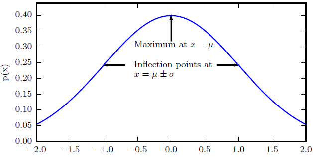
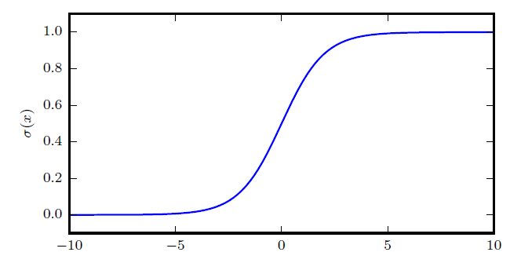
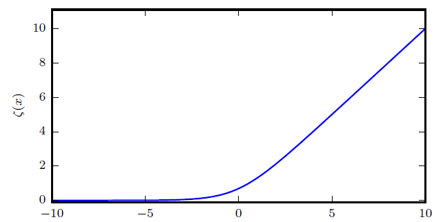

# 线性代数

## 标量、向量、矩阵、张量

定义：

- 标量（scalar）：一个单独的数
- 向量（vector）：一列数
- 矩阵（matrix）：二维数组
- 张量（tensor）：超过二维的数组

操作：

- 转置（transpose）：$(A^T)_{i,j=A_{j,i}}$
- 广播（broadcasting）：$C_{i,j}=A_{i,j}+b_j$
- 矩阵乘法（matrix multiply)：$C_{i,j}=\sum_kA_{i, k}B_{k, j}$
- 哈达玛积（hadamard product）：即逐元素积，$C=A\odot B$
- 点积（dot product）：长度相同的向量，$<x, y>=x^Ty$

==Einsum==：爱因斯坦求和约定

基本概念：

- 自由索引（Free Indices）：箭头右边的索引
- 求和索引（Summation Indices）：只出现在箭头左边的索引

基本规则：

- 箭头左边，不同输入之间重复出现的索引：沿该维度做乘法操作
- 只出现在箭头左边的索引：计算结果在这个维度上求和
- 箭头右边的索引顺序可以任意，代表计算完成在相应维度的转置

特殊规则：

- 可以不写包括箭头在内的右边部分，输出张量的维度会根据默认规则推导
- 表达式支持省略号，表示不关心的索引。如最后两维的转置：$\dots ij\rightarrow \dots ji$

实例：

- 提取主对角线元素：$ii\rightarrow i$
- 矩阵转置：$ij\rightarrow ji$
- 求和：$ij\rightarrow$
- 列求和：$ij\rightarrow j$
- 行求和：$ij\rightarrow i$
- 矩阵-向量相乘：$ik,k\rightarrow i$
- 矩阵-矩阵相乘：$ik,kj\rightarrow ij$
- 向量点积：$i,i\rightarrow$
- 矩阵点积：$ij,ij\rightarrow$
- 哈达玛积：$ij,ij\rightarrow ij$
- 外积：$i,j\rightarrow ij$
- batch矩阵相乘：$ijk,ikl\rightarrow ikl$
- 张量缩约：$pqrs,tuqvr\rightarrow pstuv$

## 范数

范数（norm）：衡量向量大小。$L^p$范数定义为：
$$
\Vert x\Vert_p=(\sum_i|x_i|^p)^{\frac{1}{p}}
$$

- $f(x)=0\rightarrow x=0$
- $f(x+y)\le f(x)+f(y)$
- $\forall\alpha\in\mathbb R, f(\alpha x)=|\alpha|f(x)$

常用$L^p$范数：

- $p=2$时，$L^2$范数称欧几里得范数（Euclidean norm）衡量从原点出发到向量$x$确定的点的欧几里得距离。十分常用，但原点附近增长缓慢。
- $p=1$时，$L^1$范数$\Vert x\Vert_1=\sum_i|x_i|$。当零和非零元素之间的差异非常重要时，会使用$L^1$范数
- $p=\infty$时，$L^\infty$范数$\Vert x\Vert_\infty=\max_i|x_i|$称最大范数，表示向量中具有最大幅值的元素的绝对值。
- Forbenius范数：衡量矩阵的大小。$\Vert A\Vert_F=\sqrt{\sum_{i, j}A_{i, j}^2}$
- 两向量的点积可以用范数表示：$x^Ty=\Vert x\Vert_2\Vert y\Vert_2\cos\theta$

## 特殊矩阵和向量

- 对角矩阵（diagonal matrix）$D$：$\forall i\not=j, D_{i,j}=0$
- 单位矩阵（identity matrix）$I_n\in\mathbb R^{n\times n}$：主对角线1，其余位置0
- 对称（symmetric）：$A=A^T$
- 单位向量（unit vector）：具有单位范数的向量$\Vert x\Vert_2=1$
- 正交（orthogonal）：$x^Ty=0$。如果两个向量都有非零范数，那么其夹角为90°。$\mathbb R^n$中至多有$n$个非零范数单位向量相互正交，称标准正交（orthonormal）。
- 逆矩阵（matrix inversion）：$A^{-1}A=AA^{-1}=I_n$
- 正交矩阵（orthogonal matrix）：$A^TA=AA^T=I$，即$A^{-1}=A^T$

## 矩阵分解

### 特征分解

方阵$A$的特征向量（eigenvector）指与A相乘后相当于对该向量进行缩放的非零向量$v$：
$$
Av=\lambda v
$$
标量$\lambda$称为这个特征向量对应的特征值（eigenvalue）。

- 如果$v$是$A$的特征向量，$v$缩放后的任意向量$sv(s\in\mathbb R, s\not=0)$也是$A$的特征向量，且与$v$有相同的特征值。所以通常只考虑单位特征向量
- 假设$A$有$n$个线性无关的特征向量$\{v^{(1)}, \dots, v^{(n)}\}$，对应特征值$\{\lambda_1, \dots, \lambda_n\}$，则将特征向量拼接成一个矩阵，使得每一列是一个特征向量$\mathbf V=[v^{(1)}, \dots, v^{(n)}]$，将特征值连接成一个向量$\mathbf\lambda=[\lambda_1, \dots, \lambda_n]^T$，$A$的特征分解可以记作：

$$
A=Vdiag(\mathbf\lambda)V^{-1}
$$

如果方阵$A$的元素都为实数，且矩阵的转置等于本身，即$a_{ij}=a_{ji}$，称$A$为实对称矩阵。每个实对称矩阵都可以分解成实特征向量和实特征值：
$$
A=Q\Lambda Q^T
$$
$Q$是$A$的特征向量组成的正交矩阵，$\Lambda$是对角矩阵，特征值$\Lambda_{ii}$对应的特征向量是$Q$的第$i$列，记作$Q_{:,i}$

- 所有特征值都是正数的矩阵称为正定（positive definite）：$x^TAx=0\Rightarrow x=0$
- 所有特征值都是非负数的矩阵称为半正定（positive semidefinite）：$\forall x, x^TAx\ge0$
- 所有特征值都是负数的矩阵称为负定（negative definite）
- 所有特征值都是非正数的矩阵称为半负定（negative semidefinite）

### 奇异值分解

奇异值分解（singular value decomposition, SVD）：将矩阵分解为奇异向量（singular vector）和奇异值（singular value）。

假设$A$是一个$m\times n$的矩阵，可以分解为三个矩阵的乘积：
$$
A=UDV^T
$$

- $U^{m\times m}$的列向量为左奇异向量（left singular vector），是$AA^T$的特征向量
- $V^{n\times n}$的列向量为右奇异向量（right singular vector），是$A^TA$的特征向量
- $D^{m\times n}$是对角矩阵，对角线上的元素称为矩阵$A$的奇异值。$A$的非零奇异值是$A^TA$特征值的平方根，同时也是$AA^T$特征值的平方根。

### Moore-Penrose伪逆

非方阵没有逆矩阵，在$Ax=y$中，希望通过$A$的左逆$B$解线性方程，即$x=By$

矩阵$A$的伪逆定义为：
$$
A^+=\lim_{\alpha\rightarrow0}(A^TA+\alpha I)^{-1}A^T
$$
计算公式为：
$$
A^+=VD^+U^T
$$
其中$U,D,V$是矩阵$A$奇异值分解得到的矩阵，$D$的伪逆$D^+$是非零元素取倒数再转置得到的。

- $A$的列数多于行数时，用伪逆求解线性方程是一种解法。$x=A^+y$是方程所有可行解中欧几里得范数$\Vert x\Vert_2$最小的一个
- $A$的行数多于列数时，可能没有解。通过伪逆得到的$x$使得$Ax$和$y$的欧几里得距离$\Vert Ax-y\Vert_2$最小

## 迹运算

迹运算：返回矩阵对角元素的和。
$$
\mathrm{Tr}(A)=\sum_iA_{i,i}
$$
性质和作用：

- 在转置运算下不变：$\mathrm{Tr}(A)=\mathrm{Tr}(A^T)$
- 多个矩阵相乘的迹，在矩阵乘积依然定义良好的情况下，将最后一个矩阵挪到最前面后，迹不变：$\mathrm{Tr}(ABC)=\mathrm{Tr}(CAB)=\mathrm{Tr}(BCA)$
- 即使循环后矩阵乘积的形状变了，迹的结果仍然不变：$\mathrm{Tr}(AB)=\mathrm{Tr}(BA)$，尽管$AB\in\mathbb R^{m\times m}$且$BA\in\mathbb R^{n\times n}$
- 求Frobenius范数：$\Vert A\Vert_F=\sqrt{\mathrm{Tr}(AA^T)}$

## 行列式

记作$\mathrm{det}(A)$，将一个方阵$A$映射到实数。
$$
\mathrm{det}(A)=\Pi\lambda_i
$$
行列式的绝对值衡量矩阵参与乘法后空间扩大或缩小了多少。如果行列式为0，空间至少沿着某一维完全收缩了。如果行列式是1，则这个转换保持空间体积不变。

# 概率论

## 随机变量与概率分布

随机变量（random variable）：可以随机取不同值的变量

概率分布（probability distribution）：描述随机变量在每个可能取到的状态的可能性大小

### 离散型变量和概率质量函数

离散型变量的概率分布用概率质量函数（probability mass function, PMF）描述，$\mathrm{x}=x$的概率用$P(x)$表示，用$\sim$说明随机变量遵循的分布$x\sim P(x)$

PMF可以同时作用于多个随机变量，称为联合概率分布（joint probability distribution），$P(\mathrm x=x, \mathrm y=y)$表示$\mathrm x=x$和$\mathrm y=y$同时发生的概率，可以简写为$P(x,y)$

性质：

- $P$的定义域是$\mathrm x$所有可能状态的集合
- $\forall x\in\mathrm x, 0\le P(x)\le1$
- $\sum_{\mathrm x\in x}P(x)=1$

### 连续型变量和概率密度函数

连续型变量的概率分布用概率密度函数（probability density function, PDF）

性质：

- $p$的定义域是$\mathrm x$所有可能状态的集合
- $\forall x\in\mathrm x, p(x)\ge0$，并不要求$p(x)\le 1$
- $\int p(x)dx=1$

PDF没有对特定状态给出概率，而是对PDF求积分来获得点集的真实概率质量。如$x$落在$[a,b]$的概率是$\int_{[a,b]}p(x)dx$

### 边缘概率

定义在子集上的概率称为边缘概率分布（marginal probability distribution）

假设已知$P(x,y)$，可以根据求和法则计算$P(x)$：
$$
\forall x\in\mathrm x, P(\mathrm x=x)=\sum_yP(\mathrm x=x, \mathrm y=y)
$$
对于连续型变量，用积分代替求和：
$$
p(x)=\int p(x,y)dy
$$

### 条件概率

给定$\mathrm x=x$，$\mathrm y=y$发生的条件概率记为$P(\mathrm y=y|\mathrm x=x)$
$$
P(\mathrm y=y|\mathrm x=x)=\frac{P(\mathrm y=y, \mathrm x=x)}{P(\mathrm x=x)}
$$
只有在$P(\mathrm x=x)>0$才有定义。

链式法则（chain rule）：多维随机变量的联合概率分布可以分解成只有一个变量的条件概率相乘的形式，即：
$$
\begin{align}
P(a, b, c)&=P(a|b, c)P(b, c)\\
&=P(a|b, c)P(b|c)P(c)
\end{align}
$$
独立性：如果两个随机变量的概率分布可以表示成两个隐私的相乘形式，且一个因子只包含$\mathrm x$，另一个因子只包含$\mathrm y$，则两个随机变量是相互独立的（independent）：
$$
\forall x\in\mathrm x, y\in\mathrm y, p(\mathrm x=x, \mathrm y=y)=p(\mathrm x=x)p(\mathrm y=y)
$$
如果$\mathrm x$和$\mathrm y$对于$\mathrm z$的每一个值都是相互独立的，那么$\mathrm x$和$\mathrm y$在给定随机变量$\mathrm z$时是条件独立的（conditional independent）：
$$
\forall x\in\mathrm x, y\in\mathrm y, z\in\mathrm z, p(\mathrm x=x, \mathrm y=y|\mathrm z=z)=p(\mathrm x=x|\mathrm z=z)p(\mathrm y=y\mathrm z=z)
$$
用$\mathrm x\bot\mathrm y$表示相互独立，$\mathrm x\bot\mathrm y|z$表示$\mathrm x$和$\mathrm y$在给定$\mathrm z$时独立

## 期望、方差和协方差

$f(x)$关于某分布$P(x)$的期望（expectation）是当$x$由$P$产生，$f$作用于$x$时，$f(x)$的平均值

对离散变量：
$$
\mathbb E_{x\sim P}[f(x)]=\sum_xP(x)f(x)
$$
对连续变量：
$$
\mathbb E_{x\sim p}[f(x)]=\int p(x)f(x)dx
$$
期望是线性的：
$$
\mathbb E_x[\alpha f(x)+\beta g(x)]=\alpha\mathbb E_x[f(x)]+\beta\mathbb E_x[g(x)]
$$
方差（variance）衡量对$x$依据概率分布采样时，随机变量$\mathrm x$的函数值呈现的差异：
$$
\mathrm{Var}(f(x))=\mathbb E[(f(x)-\mathbb E[f(x)])^2]
$$
方差的平方根称为标准差（standard deviation）

协方差（covarianve）给出了两个变量线性相关的强度和变量的尺度：
$$
\mathrm{Cov}(f(x), g(y))=\mathbb E[(f(x)-\mathbb E[f(x)])(g(y)-\mathbb E[g(y)])]
$$

- 协方差的绝对值很大意味着变量值变化很大，且同时距离各自的均值很远
- 协方差为正代表两个变量倾向于同时取得相对较大的值
- 协方差为负代表一个变量倾向于取得较大的值的同时另一个变量倾向于取得较小的值。

随机变量$x\in\mathbb R^n$的协方差矩阵是一个$n\times n$的矩阵，且$\mathrm {Cov}(x)_{i,j}=\mathrm{Cov}(x_i, x_j)$

协方差矩阵的对角元是方差 $\mathrm{Cov}(x_i, x_i)=\mathrm{Var}(x_i)$

## 常用概率分布

### Bernoulli分布

单个二值随机变量的分布，由单个参数$\phi\in[0, 1]$控制
$$
P(\mathrm x=1)=\phi\\
P(\mathrm x=0)=1-\phi\\
P(\mathrm x=x)=\phi^x(1-\phi)^{1-x}\\
\mathbb E_x[x]=\phi\\
\mathrm{Var}(x)=\phi(1-\phi)
$$

### Multinoulli分布

Multinoulli分布（multinoulli distribution）或者范畴分布（categorical distribution）是指具有$k$个不同状态的单个离散型随机变量上的分布，其中$k$为有限值。

Multinoulli分布由向量$p\in[0,1]^{k-1}$参数化，每个分量$p_i$表示第$i$个状态的概率，第$k$个状态可以通过$1-\mathbf 1^Tp$给出。Multinoulli通常用来表示对象分类的分布。

### 高斯分布

正态分布（normal distribution），也称高斯分布（Gaussian distribution）
$$
\mathcal N(x;\mu,\sigma^2)=\sqrt{\frac{1}{2\pi\sigma^2}}\exp(-\frac{1}{2\sigma^2}(x-\mu)^2)
$$
标准正态分布：$\mu=0, \sigma=1$

正态分布由$\mu\in\mathbb R$和$\sigma\in(0,\infty)$控制，$\mu$给出了中心峰值的坐标，即均值，$\mathbb E[x]=\mu$；标准差用$\sigma$表示

**当我们缺乏关于某个实数上分布的先验知识而不知道选择怎样的形式时，正态分布是默认比较好的选择**

- 中心极限定理（central limit theorem）说明很多独立随机变量的和近似服从正态分布，很多复杂系统都可以被成功建模成正态分布的噪声。
- 具有相同方差的所有可能的概率分布在中，正态分布在实数上具有最大的不确定性，是对模型加入先验知识最少的分布。

正态分布可以推广到$\mathbb R^n$空间，称为多维正态分布，参数是一个正定对称矩阵$\Sigma$
$$
\mathcal N(\mathbf x;\mathbf\mu, \Sigma)=\sqrt{\frac{1}{(2\pi)^n\mathrm{det}(\Sigma)}}\exp(-\frac{1}{2}(\mathbf x-\mathbf\mu)^T\Sigma^{-1}(\mathbf x-\mathbf\mu))
$$

### 指数分布和Laplace分布

指数分布（exponetial distribution）：在x=0处取得边界点（sharp point）的分布
$$
p(x;\lambda)=\lambda\mathbf 1_{x\ge0}\exp(-\lambda x)
$$
用指示函数$\mathbf 1_{x\ge0}$使得当$x$取负值时概率为0

一个联系紧密的概率分布是Laplace分布，允许我们在任一点$\mu$设置概率质量的峰值：
$$
\mathrm{Laplace}(x;\mu,\gamma)=\frac{1}{2\gamma}\exp(-\frac{|x-\mu|}{\gamma})
$$

### Dirac分布和经验分布

Dirac delta函数$\delta(x)$：除0以外所有点的值都为0，但积分为1

有时希望概率分布所有质量集中在一个点上，可以利用Dirac delta函数实现
$$
p(x)=\delta(x-\mu)
$$
Dirac分布经常作为经验分布（empirical distribution）的一个组成部分出现
$$
\hat p(x)=\frac{1}{m}\sum_{i=1}^m\delta(x-x^{(i)})
$$
经验分布将概率密度$\frac{1}{m}$赋给$m$个点$x^{(1)}, \dots, x^{(m)}$，它们是给定的数据集或采样的集合。当在训练集上训练模型时，可以认为从这个训练集上得到的经验分布指明了采样来源的分布。并且，它是训练数据的似然最大的那个概率密度函数

## 常用函数

### logistic sigmoid

$$
\sigma(x)=\frac{1}{1+\exp(-x)}
$$

通常来产生Bernoulli分布中的参数$\phi$。它在变量取绝对值非常大的值时会出现饱和现象（saturate），函数将变得很平，对输入的微小改变不再敏感

###  Softplus

$$
\zeta(x)=\log(1+\exp(x))
$$

softplus可以生成正态分布的$\beta$和$\sigma$参数，因为它的范围是$(0,\infty)$。

性质：
$$
\sigma(x)=\frac{\exp(x)}{\exp(x)+\exp(0)}\\
\frac{d}{dx}\sigma(x)=\sigma(x)(1-\sigma(x))\\
1-\sigma(x)=\sigma(-x)\\
\log\sigma(x)=-\zeta(-x)\\
\frac{d}{dx}\zeta(x)=\sigma(x)\\
\forall x\in(0, 1),\sigma^{-1}(x)=\log(\frac{x}{1-x})\\
\forall x>0,\zeta^{-1}(x)=\log(\exp(x)-1)\\
\zeta(x)=\int_{-\infty}^x\sigma(y)dy\\
\zeta(x)-\zeta(-x)=x
$$

### 贝叶斯规则

贝叶斯规则（Bayes' rule）：
$$
P(x|y)=\frac{P(x)P(y|x)}{P(y)}
$$
注：$P(y)$通常使用$P(y)=\sum_xP(y|x)P(x)$计算

