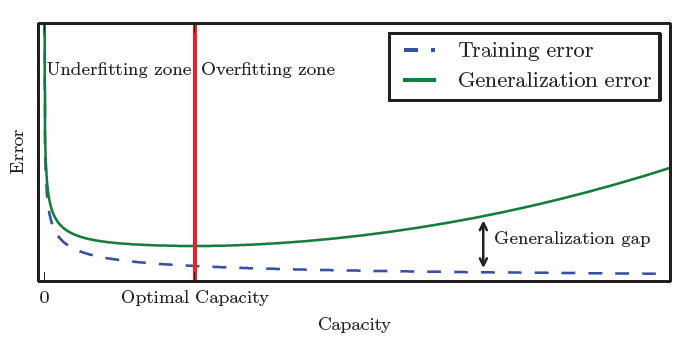
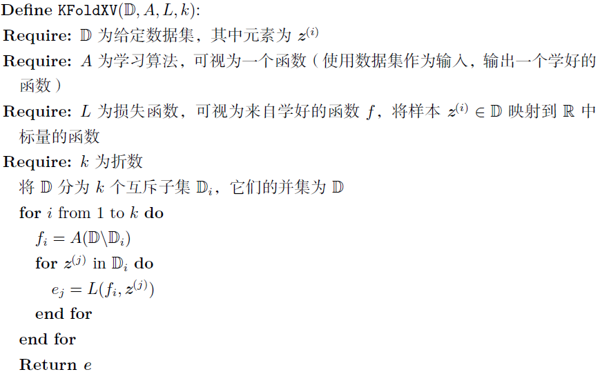

# 机器学习基础

## 学习算法

机器学习：对于某类任务$T$和性能度量$P$，一个计算机程序被认为可以从经验$E$中学习是指，通过经验$E$改进后，它在任务$T$上由性能度量$P$衡量的性能有所提升。

任务$T$：机器学习任务定义为如何处理样本（example）。样本是希望机器学习系统处理的对象或收集到的已经量化的特征（feature）的集合，通常表示为一个向量$\mathrm x\in\mathbb R^n$。

性能度量$P$：度量准确率（accuracy）或错误率（error rate）。通常更关注算法在未观测数据上的性能如何，因此使用测试集（test set）评估系统性能。

经验$E$：根据经验可以将算法大致分为无监督（unsupervised）和监督（supervised）。

- 无监督：训练含有很多特征的数据集，然后学习其上有用的结构性质
- 监督：每个样本都有一个标签（label）或目标（target）

## 容量、过拟合和欠拟合

泛化（generalization）：算法在先前未观测到的输入上表现良好的能力

训练集上计算的度量误差被称为训练误差（training error），我们也希望泛化误差（generalization error）也叫测试误差（test error）很低

独立同分布假设（i.i.d. assumption）：每个数据集中的样本都是彼此相互独立的（independent），并且训练集和测试集是同分布的（identically distributed）

决定机器学习算法效果是否好的因素：

- 降低训练误差
- 缩小训练误差和测试误差的差距

它们对应机器学习的两个主要挑战：

- 欠拟合（underfitting）：模型不能在训练集上获得足够低的误差
- 过拟合（overfitting）：训练误差和测试误差之间差距过大

通过调整模型的容量（capacity）可以控制模型偏向于欠拟合或过拟合：容量低的模型很难你和训练集，容量高的会记住不适用于测试集的训练集性质

没有免费的午餐定理（No Free Lunch Theorem）：在所有可能的数据生成分布上平均之后，每一个分类算法在未事先预测的点上都有相同的错误率。即考虑所有可能的数据生成分布时，没有一个算法总是比其他的要好。

==「All models are wrong, but some are useful」==

## 超参数和验证集

大多数算法都有超参数（super parameter），设置来控制算法行为。它被设置为不用学习的超参数，因为它不适合在训练集上学习（所有控制容量的参数都是超参数，因为越大的容量总会带来更小的训练误差，从而导致过拟合）

验证集（validation set）：我们需要调整算法超参数，由于测试样本不能以任何形式参与到模型的选择中，所以我们将训练集分成两个不相交子集，一个用于学习参数，另一个作为验证集，估计训练中或训练后的泛化误差，更新超参数。

k折交叉验证：给定数据集$\mathbb D$太小而难以产生泛化误差的准确估计时（$L$可能具有过高的方差），k折交叉验证可以估计学习算法$A$的泛化误差。

## 估计、偏差和方差

### 估计

点估计（point estimatior）或统计量（statistics）是$m$个独立同分布的数据点$\{x^{(1)}, \dots, x^{(m)}\}$的任意函数：
$$
\hat\theta_m=g(x^{(1)}, \dots, x^{(m)})
$$
函数估计：试图从输入向量$x$预测变量$y$，假设函数$f(x)$表示$y$和$x$之间的近似关系，如$y=f(x)+\epsilon$，在函数估计中，我们用模型估计去近似$f$，它是函数空间中的一个点估计

### 偏差

估计的偏差：
$$
\mathrm{bias}(\hat\theta_m)=\mathbb{E}(\hat\theta_m)-\theta
$$

- 如果$\mathrm{bias}(\hat\theta_m)=0$，估计量$\hat\theta_m$是无偏的（unbiased），即$\mathbb E(\hat\theta_m)=\theta$
- 如果$\lim_{m\rightarrow\infty}\mathrm{bias}(\hat\theta_m)=0$，估计量${\hat\theta}_m$是渐进无偏的（asymptotically unbiased），即$\lim_{m\rightarrow\infty}\mathbb E(\hat\theta_m)=0$

### 方差和标准差

方差（variance）$\mathrm{Var}(\hat\theta)$，其中随机变量是训练集，方差的平方根称为标准差（standard error），记作$\mathrm{SE}(\hat\theta)$

### 权衡偏差和方差

偏差度量偏离真实函数或参数的误差期望；方差度量数据上任意特定采样可能导致的估计期望的偏差。

当在一个偏差更大的估计和一个方差更大的估计中选择时，可以比较这些估计的均方误差（mean square error）：
$$
\begin{align}
\mathrm{MSE}&=\mathbb E[(\hat\theta_m-\theta)^2]\\
&=\mathrm{Bias}(\hat\theta_m)^2+\mathrm{Var}(\hat\theta_m)^2
\end{align}
$$

### 一致性

我们希望数据点的数量$m$增加时，点估计会收敛到对应参数的真实值，即：
$$
\mathrm{plim}_{m\rightarrow\infty}\hat\theta_m=\theta
$$
$\mathrm{plim}$表示依概率收敛，即对$\forall\epsilon>0$，当$m\rightarrow\infty$时，有$P(|\hat\theta_m-\theta|>\epsilon)\rightarrow0$。上式的条件被称为一致性（consistency）。

一致性保证估计量偏差会随着数据样本增多而减少，但反过来是不正确的，渐进无偏并不意味着一致性。

## 最大似然估计

