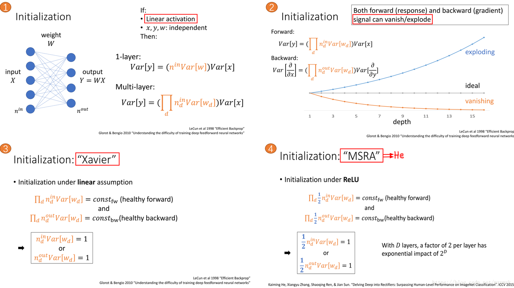
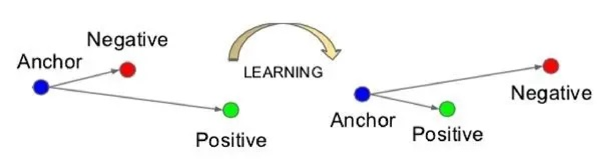
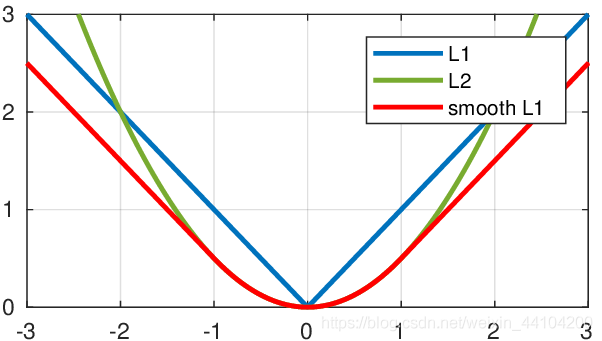

# 权重初始化方法

## Glorot条件

- 激活值的均值应为零：$\forall(i,j),\mathrm{Var}(a^i)=\mathrm{Var}(a^j)=0$
- 激活值的方差在每一层都应保持相同：$\forall(i,j),\mathrm{Var}(\frac{\partial\mathrm{Cost}}{\partial a^i})=\mathrm{Var}(\frac{\partial\mathrm{Cost}}{\partial a^j})$

在这两个假设下，反向传播的梯度信号在任何层都不应该被乘以过小或过大的值（如经过Sigmoid时离中心较远导致的梯度消失）。它应该在不产生梯度爆炸或梯度消失的情况下传播到输入层。

- 如果权值的初始值过大，则loss function相对于权值参数的梯度值很大，每次利用梯度下降更新参数的时，参数更新的幅度也会很大，这就导致loss function的值在其最小值附近震荡。
- 而过小的初值值则相反，loss关于权值参数的梯度很小，每次更新参数时，更新的幅度也很小，着就会导致loss的收敛很缓慢，或者在收敛到最小值前在某个局部的极小值收敛了。

## Xavier初始化

> [Understanding the difficulty of training deep feedforward neural networks](http://proceedings.mlr.press/v9/glorot10a) 

推导：考虑layer $l$ 前向：
$$
\begin{align*}
z^{[l]}&=W^{[l]}a^{[l-1]}+b^{[l]}\\
a^{[l]}&=g^{[l]}(z^{[l]})
\end{align*}
$$
希望以下关系成立：
$$
\begin{align*}
\mathbb E[a^{[l-1]}]&=\mathbb E[a^{[l]}]=0\\
\mathrm{Var}(a^{[l-1]})&=\mathrm{Var}(a^{[l]})
\end{align*}
$$
确保每层输入的零均值和保持方差值，可以确保没有梯度爆炸或梯度消失的信号。

假设：激活函数是$\tanh$，网络正确初始化，输入被归一化，$\tanh$是近似线性的，即$\tanh(z^{[l]})=z^{[l]}$，有：
$$
\mathrm{Var}(a^{[l]})=\mathrm{Var}(z^{[l]})
$$
且$z^{[l]}=W^{[l]}a^{[l-1]}+b^{[l]}$（先假设$b^{[l]}=0$），element-wise形式为：
$$
\mathrm{Var}(a_k^{[l]})=\mathrm{Var}(z_k^{[l]})=\mathrm{Var}(\sum_{j=1}^{n^{[l-1]}}w_{kj}^{[l]}a_j^{[l-1]})
$$
假设：

- Weights $W^{[l]}$ i.i.d
- Inputs $a^{[l]}$ i.i.d.
- Weights 和 Inputs 相互独立

上式的求和符号提取出来，得：
$$
\mathrm{Var}(a_k^{[l]})=\mathrm{Var}(z_k^{[l]})=\mathrm{Var}(\sum_{j=1}^{n^{[l-1]}}w_{kj}^{[l]}a_j^{[l-1]})=\sum_{j=1}^{n^{[l-1]}}\mathrm{Var}(w_{kj}^{[l]}a_j^{[l-1]})
$$
将两个随机变量的乘积的方差转换成方差的乘积，公式为：
$$
\mathrm{Var}(XY)=\mathbb E[X]^2*\mathrm{Var}(Y)+\mathrm{Var}(X)*\mathbb E[Y]^2+\mathrm{Var}(X)*\mathrm{Var}(Y)
$$
应用于$X=w_{kj}^{[l]}$和$Y=a_j^{[l-1]}$，有：
$$
\mathrm{Var}(w_{kj}^{[l]}a_j^{[l-1]})=\mathbb E[w_{kj}^{[l]}]^2*\mathrm{Var}(a_j^{[l-1]})+\mathrm{Var}(w_{kj}^{[l]})*\mathbb E[a_j^{[l-1]}]^2+\mathrm{Var}(w_{kj}^{[l]})*\mathrm{Var}(a_j^{[l-1]})
$$
由于权重是零均值初始化，且输入经过归一化，即$\mathbb E[w_{kj}^{[l]}]=\mathbb E[a_j^{[l-1]}]=0$，带入得：
$$
\mathrm{Var}(z_k^{[l]})=\sum_{j=1}^{n^{[l-1]}}\mathrm{Var}(w_{kj}^{[l]})\mathrm{Var}(a_j^{[l-1]})=\sum_{j=1}^{n^{[l-1]}}\mathrm{Var}(W^{[l]})\mathrm{Var}(a^{[l-1]})=n^{[l-1]}\mathrm{Var}(W^{[l]})\mathrm{Var}(a^{[l-1]})
$$
前两条假设可以得到：
$$
\mathrm{Var}(w_{kj}^{[l]})=\mathrm{Var}(w_{11}^{[l]})=\mathrm{Var}(w_{12}^{[l]})=\cdots=\mathrm{Var}(W^{[l]})
$$

$$
\mathrm{Var}(a_j^{[l-1]})=\mathrm{Var}(a_1^{[l-1]})=\mathrm{Var}(a_2^{[l-1]})=\cdots=\mathrm{Var}(a^{[l-1]})
$$

综合起来，我们得到：
$$
\mathrm{Var}(a^{[l]})=n^{[l-1]}\mathrm{Var}(W^{[l]})\mathrm{Var}(a^{[l-1]})
$$
如果想要在不同层保持相同的方差，即$\mathrm{Var}(a^{[l]})=\mathrm{Var}(a^{[l-1]})$，就需要：
$$
\mathrm{Var}(W^{[l]})=\frac{1}{n^{[l-1]}}
$$
即Xavier初始化。

对于输出层L，我们可以把输出层方差和输入联系起来：
$$
\begin{align*}
\mathrm{Var}(a^{[l]})&=n^{[l-1]}\mathrm{Var}(W^{[L]})\mathrm{Var}(a^{[l-1]})\\
&=n^{[l-1]}\mathrm{Var}(W^{[L]})n^{[l-2]}\mathrm{Var}(W^{[l-1]})\mathrm{Var}(a^{[L-2]})\\
&=\cdots\\
&=\Big[\prod_{l=1}^Ln^{[l-1]}\mathrm{Var}(W^{[l]})\Big]\mathrm{Var}(x)
\end{align*}
$$
对于$n^{[l-1]}\mathrm{Var}(W^{[l]})$的大小，有三种情况：
$$
n^{[l-1]}\mathrm{Var}(W^{[l]})\left\{\begin{array}{l}
<1, \mathrm{Vanishing\ Signal} \\
=1, \mathrm{Var}(a^{[L]})=\mathrm{Var}(x)\\
>1, \mathrm{Exploding\ Signal}
\end{array}\right.
$$
在反向过程中的情况类似，我们应使$n^{[l]}\mathrm{Var}(W^{[l]})=1$，即$\mathrm{Var}(W^{[l]})=\frac{1}{n^{[l]}}$

在实践中，我们取二者的调和平均，即将权重初始化为
$$
\mathcal N(0, \frac{2}{n^{[l-1]}+n^{[l]}})
$$
如果是$[-r,r]$上的均匀初始化，即方差u一致：$\frac{2}{n^{[l-1]}+n^{[l]}}=\frac{r^2}{3}$，得：
$$
\mathcal U\Big[-\sqrt\frac{6}{n^{[l-1]}+n^{[l]}},\sqrt\frac{6}{n^{[l-1]}+n^{[l]}}\Big]
$$
缺点：

- 激活函数是线性的，并不适应于ReLU，sigmoid等非线性激活函数
- 激活函数是关于0对称的，不适应于ReLU，sigmoid等不是关于0对称的激活函数

## He初始化 (MSRA)

> [Delving Deep into Rectifiers: Surpassing Human-Level Performance on ImageNet Classification](https://arxiv.org/abs/1502.01852)

思想：经过relu之后，假定每层有一半神经元被激活，另一半为0，即
$$
\begin{align*}
\mathrm{Var}(Y_i)&=n^{[l-1]}\mathrm{Var}(w_i)\mathrm{Var}(X_i)+\mathbb E^2[X_i]*\mathrm{Var}(w_i)\\
&=n^{[l-1]}\Big(\mathrm{Var}(w_i)*(\mathbb E[X_i^2]-\mathbb E^2[X_i]))+\mathbb E^2[X_i]*\mathrm{Var}(w_i)\Big)\\
&=n^{[l-1]}*\mathrm{Var}(w_i)*\mathbb E[X_i^2]
\end{align*}
$$
由于$X_i=\max(0, Y_{i-1})$，且假设$Y_{i-1}$正负均匀，即$\mathrm{Var}(Y_{i-1})=\mathbb E[Y_{i-1}^2]$，可得：
$$
\mathbb E[X_i^2]=\frac{1}{2}\mathrm{Var}(Y_{i-1})
$$
带入上式，有：
$$
\mathrm{Var}(Y_i)=\frac{1}{2}n^{[l-1]}*\mathrm{Var}(w_i)*\mathrm{Var}(Y_{i-1})
$$
需要满足$\mathrm{Var}(Y_i)=\mathrm{Var}(Y_{i-1})$，则：
$$
\mathrm{Var}(w_i)=\frac{2}{n^{[l-1]}}
$$
即He初始化：$\mathcal N(0, \frac{2}{n^{[l-1]}})$

# 损失函数

损失函数：评价模型的预测值和真实值不一样的程度，损失函数越好，通常模型的性能越好。不同的模型用的损失函数一般也不一样。

- 经验风险损失函数：预测结果和实际结果的差别
- 结构风险损失函数：经验风险损失函数加上正则项

损失Loss必须是标量，因为向量无法比较大小（向量本身需要通过范数等标量来比较）

## 0-1损失函数

$$
\mathcal L(y_i, f(x_i))=\left\{\begin{array}{l}
1, \mathrm{if}\;y_i \neq f(x_i) \\
0, \mathrm{if}\;y_i = f(x_i)
\end{array}\right.
$$

- 0-1损失可用于分类问题，但是由于该函数是非凸的，在最优化过程中求解不方便，有阶跃，不连续。0-1 loss无法对x进行求导，在依赖于反向传播的深度学习任务中，无法被使用，所以使用不多。

## Hinge Loss

主要用于支持向量机（SVM）中，它的称呼来源于损失的形状：
$$
\mathcal L(f(x), y) = \max(0, 1 - yf(x))
$$
其中$y=\pm1$，$f(x)=wx+b$，当为SVM的线性核时。如果分类正确，loss=0，如果错误则为$1-f(x)$，所以它是一个分段不光滑的曲线。Hinge loss被用来解 SVM 中的间隔最大化问题。

## Softmax-loss 多分类

$$
L(y, z)=-\log(\frac{e^{z_y}}{\sum_je^{z_j}})=\log(\sum_je^{z_j})-z_j
$$

其中$\frac{e^{z_y}}{\sum_je^{z_j}}$是softmax函数计算的类别概率

使用Softmax分类的前提：==类别之间都是相互独立的==

Softmax分类的本质：将特征向量做归一化处理（输出总是和为1），将线性预测值转换为类别概率

## Logistic-loss 二分类交叉熵

$$
L(y', y) = -\frac{1}{m}\sum_{i=1}^my_i\log y_i'+(1-y_i)\log(1-y_i')
$$

Logistic 不使用平方损失的原因：平方损失会导致损失函数是非凸的，不利于求解，因为非凸函数会存在许多的局部最优解。

## Cross Entropy loss

cross entropy loss用于度量两个概率分布之间的相似性
$$
L=-\sum_{i=1}^my_i\log p_i
$$

- $y_i$为样本的真实标签，取值只能为0或1
- $p_i$为预测样本属于类别  的概率
- $m$为类别的数量

## Softmax cross entropy

如果概率是通过softmax计算得到的，那么就是softmax cross entropy
$$
L=-\sum_{k=1}^n\sum_{i=1}^cp_{k,i}\log q_{k,i}
$$

- $p_{k, i}$表示样本$k$属于类别$i$的概率（真实标签，只能为0或1）
- $q_{k,i}$表示Softmax预测的样本$k$属于类别$i$的概率
- $c$是类别数
- $n$是样本总数

## Triplet loss

用于训练==差异性较小==的样本，如人脸等。数据包括锚例、正例、负例，通过优化锚例与正例的距离小于锚例与负例的距离，实现样本的相似性计算。也就是说通过学习后，使得同类样本的 positive 更靠近Anchor，而不同类的样本Negative则远离Anchor。

- 从训练数据集中随机选一个样本，该样本称为Anchor，再随机选取一个与Anchor  (记为$x_a$)属于同一类的样本和不同类的样本,这两个样本对应的称为Positive (记为$x_p$)和Negative  (记为$x_n$)，由此构成一个（Anchor，Positive，Negative）三元组。

- 训练一个参数共享或不共享的网络，得到三个元素的特征表达：$f(x_i^a), f(x_i^p), f(x_i^n)$

- 使得Positive 和Anchor特征表达之间的距离尽可能小，而Anchor和Negative特征表达之间的距离尽可能大，并且要让$x_a$与$x_n$之间的距离和$x_a$与$x_p$之间的距离之间有一个最小的间隔$\alpha$，即：
  $$
  \Vert f(x_i^a)-f(x_i^p)\Vert_2^2+\alpha<\Vert f(x_i^a)-f(x_i^n)\Vert_2^2
  $$
  其中距离用欧式距离度量，$\alpha$也称为margin参数。设置一个合理的 margin 值很关键，这是衡量相似度的重要指标。

  - $\alpha$越小，loss 很容易趋近于 0 ，但很难区分相似的图像
  - $\alpha$越大，loss 值较难趋近于 0，甚至导致网络不收敛，但可以较有把握的区分较为相似的图像

目标函数：
$$
L=\max(0, \sum_i^N[\Vert f(x_i^a)-f(x_i^p)\Vert_2^2-\Vert f(x_i^a)-f(x_i^n)\Vert_2^2+\alpha])
$$
梯度推导：
$$
\begin{aligned}
\frac{\partial L}{\partial f(x_i^a)}&=2\cdot(f(x_i^a)-f(x_i^p))-2\cdot(f(x_i^a)-f(x_i^n))=2\cdot(f(x_i^n)-f(x_i^p))\\
\frac{\partial L}{\partial f(x_i^p)}&=2\cdot(f(x_i^a)-f(x_i^p))\cdot(-1)=2\cdot(f(x_i^p)-f(x_i^a))\\
\frac{\partial L}{\partial f(x_i^n)}&=-2\cdot(f(x_i^a)-f(x_i^n))\cdot(-1)=2\cdot(f(x_i^a)-f(x_i^n))
\end{aligned}
$$

- 在训练Triplet  Loss模型时，只需要输入样本，不需要输入标签，这样避免标签过多、同标签样本过少的问题，模型只关心样本编码，不关心样本类别
- Triplet  Loss在相似性计算和检索中的效果较好，可以学习到样本与变换样本之间的关联，检索出与当前样本最相似的其他样
- Triplet  Loss通常应用于个体级别的细粒度识别，比如分类猫与狗等是大类别的识别，但是有些需求要精确至个体级别，比如识别不同种类不同颜色的猫等，所以Triplet Loss最主要的应用也是在细粒度检索领域中

优点：

- 如果把不同个体作为类别进行分类训练，Softmax维度可能远大于Feature维度，精度无法保证
- Triplet Loss一般比分类能学习到更好的特征，在度量样本距离时，效果较好
- Triplet Loss支持调整阈值Margin，控制正负样本的距离，当特征归一化之后，通过调节阈值提升置信度

## MSE

均方误差（Mean Squared Error，MSE），也叫平方损失或 L2 损失，常用在最小二乘法中。它的思想是使得各个训练点到最优拟合线的距离最小（平方和最小）
$$
\mathrm{MSE}=\frac{1}{2m}\sum_{i=1}^m(y_i'-y_i)^2
$$
优点：MSE的函数曲线光滑、连续，处处可导，便于使用梯度下降算法，是一种常用的损失函数。 而且，随着误差的减小，梯度也在减小，这有利于收敛，即使使用固定的学习速率，也能较快的收敛到最小值。

缺点：当$y$和$f(x)$之间的差值大于1时，会放大误差；而当差值小于1时，则会缩小误差，这是平方运算决定的。MSE对于较大的误差($>1$)给予较大的惩罚，较小的误差$(<1)$给予较小的惩罚。也就是说，对离群点比较敏感，受其影响较大。如果样本中存在离群点，MSE会给离群点更高的权重，这就会牺牲其他正常点数据的预测效果，最终降低整体的模型性能，甚至可能引发梯度爆炸。

## MAE

**均绝对误差**（Mean Absolute Error，MAE）是所有单个观测值与算术平均值的绝对值的平均，也被称为L1损失，常用于回归问题中。与平均误差相比，平均绝对误差由于离差被绝对值化，不会出现正负相抵消的情况，因而，平均绝对误差能更好地反映预测值误差的实际情况。
$$
\mathrm{MAE}=\frac{1}{m}\sum_{i=1}^m|y_i'-y_i|
$$
优点：

- 无论对于什么样的输入值，都有着稳定的梯度，不会导致梯度爆炸问题，具有较为稳健性的解
- 对于离群点不那么敏感。因为MAE计算的是误差$y−f(x)$的绝对值，对于任意大小的差值，其惩罚都是固定的

缺点：MAE曲线连续，但是在$y−f(x)=0$处不可导。而且 MAE 大部分情况下梯度都是相等的，这意味着即使对于小的损失值，其梯度也是大的。这不利于函数的收敛和模型的学习。

由于L1 loss 具有稀疏性，为了惩罚较大的值，因此常常将其作为正则项添加到其他loss中作为约束

## Smooth L1 loss

$$
\mathrm{Smooth\ L1}(x)=\left\{\begin{array}{l}
0.5x^2, \mathrm{if}\;|x|<1 \\
|x|-0.5, \mathrm{otherwise}
\end{array}\right.
$$

Smooth L1能从两个方面限制梯度：

- 当估计值与ground truth差别过大时，梯度值不至于过大
- 当估计值与ground truth差别很小时，梯度值足够小

这样设置让loss对于离群点更加鲁棒，相比于L2损失函数，其对离群点、异常值不敏感，可控制梯度的量级使训练时不容易跑飞

# 熵

## 信息熵 information entropy

### 量化信息

一条信息的信息量大小和它的不确定性有直接的关系，信息量的度量就等于不确定性的多少。换言之，概率越小，不确定性越大，信息所包含的信息量就越大。对于一件确定的事情，其信息量就为0。

考虑一个离散的随机变量x，那么信息的量度$I(x)$应满足以下条件：
* 单调性：随机变量发生的概率$p(x)$概率越小，其信息量应越大
* 非负性：概率$p(x)∈[0,1]$，信息量应非负
* 可加性：如果我们有两个不相关的事件$x$和$y$，那么观察两个事件同时发生时获得的信息量应该等于观察到事件各自发生时获得的信息之和。即$I(x,y)=I(x)+I(y)$

因为两个事件是独立不相关的，因此有$p(x,y)=p(x)p(y)$。

根据这些性质，可以很容易找到一个符合条件的函数：负对数，即
$$
I(x)=-\log p(x)
$$
注：

* $\log$的基可以任意选取。信息论中基常常选择为2，因此信息的单位为**比特bits**；而机器学习中基常常选择为自然常数，因此单位常常被称为**奈特nats**
* 因为$p(x)$可能为0，而$\log0$无意义，所以此处定义$0\log0=0$

### 信息熵

如果把这个事件的所有可能性罗列出来，就可以求得该事件信息量的期望，也即信息熵：
$$
H(X)=\mathbb E[I(x)]=-\sum_{x\in X}p(x)\log p(x)
$$
信息熵反映了一个系统的无序化（有序化）程度，一个系统越无序，信息熵就越高。显然，随机变量的取值个数越多，状态数也就越多，信息熵就越大，混乱程度就越大。当随机分布为均匀分布时，熵最大。

### 联合熵

将一维随机变量分布推广到多维随机变量分布，则可得联合熵 (Joint entropy) 为：
$$
H(X,Y)=-\sum_{x,y}p(x,y)\log p(x,y)=-\sum_{i=1}^n\sum_{j=1}^mp(x_i,y_i)\log p(x_i,y_i)
$$

## 条件熵 conditional entropy

条件熵$H(Y|X)$表示在已知随机变量$X$的条件下随机变量$Y$的不确定性。定义为$X$给定条件下$Y$的条件概率分布的熵对 $X$的数学期望：
$$
\begin{align}
H(Y|X)&=\sum_xp(x)H(Y|X=x)\\
&=-\sum_xp(x)\sum_yp(y|x)\log p(y|x)\\
&=-\sum_{x,y}p(x,y)\log p(y|x)
\end{align}
$$
联合熵$H(X,Y)$ = 条件熵$H(Y|X)$ + 单独的熵$H(X)$
$$
\begin{align}

H(X,Y)&=-\sum_{x,y}p(x,y)\log p(x,y)\\
&=-\sum_{x,y}p(x,y)\log (p(y|x)p(x))\\
&=-\sum_{x,y}p(x,y)\log p(y|x)-\sum_{x,y}p(x,y)\log p(x)\\
&=H(Y|X)-\sum_x\log p(x)\sum_yp(x,y)\\
&=H(Y|X)-\sum_xp(x)\log p(x)\\
&=H(Y|X)+H(X)
\end{align}
$$
理解：描述 X 和 Y 所需的信息是描述 X 自己所需的信息,加上给定  X 的条件下具体化  Y 所需的额外信息。

## 相对熵 relative entropy

也称KL散度(Kullback–Leibler divergence)，用来量度两个概率分布之间的差异（不相似性）。

设$p(x)$、$q(x)$是离散随机变量$X$中取值的两个概率分布，则$p$对$q$的相对熵是：
$$
D_{KL}(p||q)=\sum_xp(x)\log \frac{p(x)}{q(x)}=\mathbb E_{p(x)}\log \frac{p(x)}{q(x)}
$$
性质：

* $D_{KL}(p||q)\ge0$，当且仅当$p(x)=q(x)$时，$D_{KL}(p||q)=0$
* 不对称性：$D_{KL}(p||q)\not = D_{KL}(q||p)$

## 交叉熵 cross entropy

用来量度模拟分布$q(x)$与真实分布$p(x)$之间的差距。

对相对熵的公式进行变形：

$$
D_{KL}(p||q)=\sum_xp(x)\log \frac{p(x)}{q(x)}=-\sum_xp(x)\log q(x)-(-\sum_xp(x)\log p(x))
$$

对于真实分布$p(x)$来说，后面那项，也就是分布的熵$-\sum_xp(x)\log p(x)$为一常数（代表训练数据的分布是固定不变的），可不关注。而表达式剩下的第一项就是交叉熵，即：
$$
H(p||q)=-\sum_xp(x)\log q(x)
$$

在分类问题中，希望模型预测出的模拟分布$q(x)$与真实分布$p(x)$的差距尽可能小，所以交叉熵常被用作分类问题的损失函数(loss function)，minimize交叉熵的时候，其实就是在让模拟分布更靠近真实分布。

## 熵的另一种理解

熵的本质的另一种理解：最短平均编码长度（即当编码方式完美时，编码长度的期望值）

编码方式：哈夫曼编码。即：使用更短的编码来描述更可能的事件，使用更长的编码来描述不太可能的事件。

举例：考虑某随机变量$x$，有四种等可能的状态$\{a, b, c, d\}$，为了把$x$的值传给别人，我们需要对其状态进行编码，我们将四种状态编码为00,01,10,11，无论$x$在哪个状态下，编码都需要2 bits长度。

其信息熵（由于计算机为二进制，故在信息论中$\log$的底常为2）为：
$$
H(X)=-\sum_xp(x)\log p(x)=-4*\frac{1}{4}\log_2\frac{1}{4}=2\,bits
$$

当$x$的分布发生变化，四种可能的状态概率变为$\{\frac{1}{2},\frac{1}{4},\frac{1}{8},\frac{1}{8}\}$时，我们用更短的编码描述概率更大的状态，可用哈夫曼编码为0,10,110,111

那么平均编码长度，也即信息熵为：
$$
H(X)=-\sum_xp(x)\log p(x)=-(\frac{1}{2}\log_2\frac{1}{2}+\frac{1}{4}\log_2\frac{1}{4}+2*\frac{1}{8}\log_2\frac{1}{8})=1.75\,bits
$$

也印证了之前当随机分布为均匀分布时，熵最大的结论。

这样的理解也可以推广到相对熵和交叉熵上去：

- 相对熵含义：用模型分布编码真实分布时，所额外消耗的编码长度。
- 交叉熵含义：使用了模型分布编码真实分布时，得到的平均编码长度

从这里也可以得到 信息熵+相对熵=交叉熵 的结论。